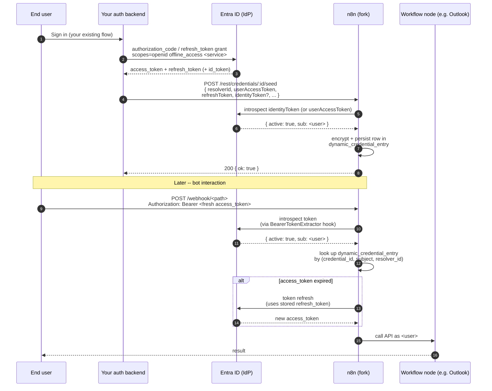

# Programmatic Credential Seeding -- Setup & Auth-Backend Integration

A fork-only extension to n8n's Dynamic Credentials feature. The vanilla
[Dynamic-Credentials-Guide.md](./Dynamic-Credentials-Guide.md) walks each end
user through an interactive OAuth consent screen. **This guide is for the
alternative path**: your own auth backend already holds the user's OAuth tokens
(e.g. from your platform's Entra/Azure AD login) and pushes them into n8n
server-to-server, with zero consent UI on the n8n side.

It pairs with the new endpoint `POST /rest/credentials/:id/seed`, documented in
`CUSTOMS.md` section 9. The runtime contract there is the source of truth; this
guide is the operator + auth-backend recipe.

---

## Table of contents

- [When to use seeding vs interactive consent](#when-to-use-seeding-vs-interactive-consent)
- [End-to-end flow](#end-to-end-flow)
- [Prerequisites](#prerequisites)
- [Part 1: One-time operator setup](#part-1-one-time-operator-setup)
  - [Step 1: Enable the feature](#step-1-enable-the-feature)
  - [Step 2: Register the OAuth2 resolver](#step-2-register-the-oauth2-resolver)
  - [Step 3: Create the dynamic credential](#step-3-create-the-dynamic-credential)
- [Part 2: Auth-backend integration (per user)](#part-2-auth-backend-integration-per-user)
  - [Sample: Node.js / TypeScript](#sample-nodejs--typescript)
  - [Sample: curl](#sample-curl)
- [Part 3: Microsoft Entra cookbook](#part-3-microsoft-entra-cookbook)
  - [Common app-registration steps](#common-app-registration-steps)
  - [Microsoft Graph services (Outlook, Teams, OneDrive)](#microsoft-graph-services-outlook-teams-onedrive)
  - [SharePoint (non-Graph audience)](#sharepoint-non-graph-audience)
  - [Azure OpenAI (non-Graph audience)](#azure-openai-non-graph-audience)
- [Part 4: Operations](#part-4-operations)
  - [When to re-seed](#when-to-re-seed)
  - [Monitoring & observability](#monitoring--observability)
  - [Rotation, revocation, off-boarding](#rotation-revocation-off-boarding)
- [Part 5: Troubleshooting](#part-5-troubleshooting)
- [Self-Seeding from OIDC Login (no external auth backend)](#self-seeding-from-oidc-login-no-external-auth-backend)
  - [When to pick this path](#when-to-pick-this-path)
  - [Setup steps](#setup-steps)
  - [Environment variables](#environment-variables)
  - [Audit events](#audit-events)
  - [App-only credentials for unattended workflows](#app-only-credentials-for-unattended-workflows)
  - [Self-seed troubleshooting](#self-seed-troubleshooting)
  - [Webhook lazy-seed (Phase 2)](#webhook-lazy-seed-phase-2)
  - [JWT-claim validation for api-audience tokens](#jwt-claim-validation-for-api-audience-tokens)
  - [Required Graph delegated scopes per node](#required-graph-delegated-scopes-per-node)
  - [After-consent-change: force a fresh OBO exchange](#after-consent-change-force-a-fresh-obo-exchange)
  - [Validation Method dropdown — when to pick which](#validation-method-dropdown--when-to-pick-which)
  - [Log redaction — what's actually emitted](#log-redaction--whats-actually-emitted)
  - [Operator recipe — DB-direct resolver patch](#operator-recipe--db-direct-resolver-patch)
- [Explicitly not supported](#explicitly-not-supported)
  - [Verified live (use cases known to work today)](#verified-live-use-cases-known-to-work-today)
- [API reference](#api-reference)

---

## When to use seeding vs interactive consent

| Trait                                                          | Interactive flow (Dynamic-Credentials-Guide.md) | **Seeding (this guide)**                                       |
| -------------------------------------------------------------- | ----------------------------------------------- | -------------------------------------------------------------- |
| User sees a consent screen on n8n                              | Yes                                             | No                                                             |
| Per-user enrollment trigger                                    | First call to `/authorize`                      | Auth backend pushes tokens after the user logs in elsewhere    |
| Refresh tokens come from                                       | n8n's own OAuth callback                        | Your auth backend (you supply both access + refresh tokens)    |
| Best for                                                       | Standalone n8n deployments                      | Bot platforms that already federate identity with the user IdP |
| Works with non-Graph audiences (SharePoint, Azure OpenAI, ...) | Yes, with one Entra app per audience            | Yes, with a single Entra app and `identityToken` split         |

Mix both: a tenant can use the interactive flow for a subset of users and
seeding for the rest. Same credential, same resolver, same DB rows -- the seed
endpoint and the OAuth callback both end up calling
`OauthService.saveDynamicCredential` and therefore producing
byte-identical records.

---

## End-to-end flow



Two things to internalise from the diagram:

1. **Steps 3-7 are one-time per user.** They happen out-of-band, on the auth
   backend, exactly once when the user enrolls (or when their tokens are
   force-rotated). There is no need to call `/seed` on every workflow run.
2. **Steps 8-13 are every-request.** The workflow uses the *stored* tokens. The
   `Authorization` header on the webhook only carries an identity assertion --
   it is **not** what the downstream node uses to talk to the API.

---

## Prerequisites

- A fork build that includes the seeding endpoint (section 9 of `CUSTOMS.md`).
  Verify by checking that `dist/modules/dynamic-credentials.ee/credential-seed.controller.js`
  exists in the n8n image.
- `N8N_ENV_FEAT_DYNAMIC_CREDENTIALS=true` set on every n8n process (main +
  workers).
- Enterprise license with `feat:dynamicCredentials`, or the fork's
  license-check bypass (see `Dynamic-Credentials-Guide.md` step 1).
- One Entra app registration, admin-pre-consented for every scope you intend
  to use (no consent dialog appears for end users).
- An auth backend that holds the user's refresh token (i.e. you obtained
  `offline_access` during your own user login). Without a refresh token the
  seeded credential expires after one access-token lifetime (~60 min on Entra).
- Reachability between auth backend and n8n: the backend must POST to
  `<n8n>/rest/credentials/:id/seed`. Lock that down with network policy /
  service mesh / mTLS -- the endpoint is unauthenticated at the HTTP level
  (see `CUSTOMS.md` section 9, "Auth model").

---

## Part 1: One-time operator setup

### Step 1: Enable the feature

```bash
# Required
N8N_ENV_FEAT_DYNAMIC_CREDENTIALS=true

# Strongly recommended: the static-token gate for the seed/authorize/revoke
# endpoints. Without this, anyone who can reach the n8n REST surface from
# inside your network can seed credentials.
N8N_DYNAMIC_CREDENTIALS_ENDPOINT_AUTH_TOKEN=<long random string>

# Optional CORS settings -- only relevant if a browser will call /seed
# (typically NOT the case; auth backends are server-side).
N8N_DYNAMIC_CREDENTIALS_CORS_ORIGIN=https://your-auth-backend.example.com
N8N_DYNAMIC_CREDENTIALS_CORS_ALLOW_CREDENTIALS=false
```

Restart all n8n processes. Confirm the module loaded with
`GET /rest/credential-resolvers/types` -- it returns `[]` only if the module
failed to mount.

### Step 2: Register the OAuth2 resolver

The resolver is what validates the identity tokens you pass in the seed call
and on every webhook hit. For Microsoft, point it at Entra's OIDC userinfo
endpoint or at Graph's `/me`:

```bash
curl -X POST <n8n>/rest/credential-resolvers \
  -H "Cookie: n8n-auth=<owner-session>" \
  -H "Content-Type: application/json" \
  -d '{
    "name": "Entra (Graph)",
    "type": "credential-resolver.oauth2-1.0",
    "config": {
      "metadataUri": "https://login.microsoftonline.com/<tenant-id>/v2.0/.well-known/openid-configuration",
      "clientId": "<entra-app-id>",
      "clientSecret": "<entra-app-secret>",
      "validation": "oauth2-userinfo"
    }
  }'
```

Keep the `id` returned -- that's the `resolverId` your auth backend will use.

Use **one resolver per identity-validation strategy**, not per Microsoft
service. SharePoint and Outlook can share a resolver as long as the resolver
validates Graph-audience tokens; the per-service difference is on the
`userAccessToken` you store, not on the identity proof.

### Step 3: Create the dynamic credential

Through the n8n UI: create the typed credential as you normally would
(Microsoft Outlook OAuth2 API, Microsoft Teams OAuth2 API, etc.). Then mark it
as dynamic and link it to the resolver from step 2 (the "Resolver" dropdown is
visible once Dynamic Credentials is enabled).

You don't need to fill in `Access Token` / `Refresh Token` -- the seed call
will populate them per user. The OAuth2 client ID / secret / authUrl /
accessTokenUrl fields are only used for the refresh-token grant later, so
they DO need to match the Entra app from Step 2.

Note the credential ID -- the auth backend uses it in the seed URL.

---

## Part 2: Auth-backend integration (per user)

This is the only piece your auth backend needs to add. Call it from your
post-login handler (or wherever you currently land after a user signs into
your platform).

### Sample: Node.js / TypeScript

```typescript
// Acquire a Graph-audience token + refresh token from Entra
// for the user who just signed in. Whatever flow you already use --
// MSAL OBO, refresh-token grant, etc. -- works here. Just make sure
// `offline_access` is in the scopes so you get a refresh token.

interface EntraTokens {
  access_token: string;
  refresh_token: string;
  id_token?: string;
  expires_in: number;
  scope: string;
}

async function getUserTokens(userId: string): Promise<EntraTokens> {
  // ... your existing implementation ...
}

interface SeedResult {
  ok: true;
}

async function seedN8nCredential(opts: {
  n8nBaseUrl: string;            // e.g. https://n8n.your-platform.com
  credentialId: string;          // from Step 3
  resolverId: string;            // from Step 2
  endpointAuthToken: string;     // N8N_DYNAMIC_CREDENTIALS_ENDPOINT_AUTH_TOKEN
  tokens: EntraTokens;
  // Set this when the user-facing service is NOT Microsoft Graph (e.g.
  // SharePoint, Azure OpenAI). Pass a Graph-audience access_token you
  // acquired in parallel; the resolver will use it to derive the storage
  // subject while userAccessToken is the service-audience token actually
  // stored for the workflow.
  identityToken?: string;
  metadata?: Record<string, unknown>;
}): Promise<SeedResult> {
  const url = `${opts.n8nBaseUrl}/rest/credentials/${opts.credentialId}/seed`;

  const body = {
    resolverId: opts.resolverId,
    userAccessToken: opts.tokens.access_token,
    refreshToken: opts.tokens.refresh_token,
    tokenType: 'Bearer',
    expiresIn: opts.tokens.expires_in,
    scope: opts.tokens.scope,
    identityToken: opts.identityToken,
    extraTokenFields: opts.tokens.id_token
      ? { id_token: opts.tokens.id_token }
      : undefined,
    metadata: opts.metadata,
  };

  const res = await fetch(url, {
    method: 'POST',
    headers: {
      'Content-Type': 'application/json',
      // This is the n8n network-level gate. NOT a user assertion -- it's
      // a shared secret between your auth backend and n8n.
      'X-Authorization': `Bearer ${opts.endpointAuthToken}`,
    },
    body: JSON.stringify(body),
  });

  if (!res.ok) {
    const detail = await res.text();
    throw new Error(`n8n seed failed: ${res.status} ${detail}`);
  }

  return (await res.json()) as SeedResult;
}
```

Wire it like:

```typescript
app.post('/auth/callback', async (req, res) => {
  const tokens = await exchangeCodeForTokens(req.body.code);  // your code
  const userId = await whoAmI(tokens);

  await seedN8nCredential({
    n8nBaseUrl: process.env.N8N_BASE_URL!,
    credentialId: process.env.N8N_OUTLOOK_CRED_ID!,
    resolverId: process.env.N8N_ENTRA_RESOLVER_ID!,
    endpointAuthToken: process.env.N8N_SEED_TOKEN!,
    tokens,
    metadata: { tenantId: req.body.tenantId, source: 'post-login' },
  });

  res.redirect('/');
});
```

### Sample: curl

```bash
curl -X POST "$N8N_BASE_URL/rest/credentials/$CREDENTIAL_ID/seed" \
  -H "Content-Type: application/json" \
  -H "X-Authorization: Bearer $N8N_SEED_TOKEN" \
  -d "$(cat <<JSON
  {
    "resolverId": "$RESOLVER_ID",
    "userAccessToken": "$USER_ACCESS_TOKEN",
    "refreshToken": "$USER_REFRESH_TOKEN",
    "tokenType": "Bearer",
    "expiresIn": 3599,
    "scope": "openid offline_access Mail.ReadWrite Calendars.ReadWrite",
    "metadata": { "source": "manual-test" }
  }
JSON
)"
```

Expected response on success:

```http
HTTP/1.1 200 OK
Content-Type: application/json

{ "data": { "ok": true } }
```

---

## Part 3: Microsoft Entra cookbook

### Common app-registration steps

1. **Single confidential client** in your Entra tenant (or multi-tenant if your
   platform is multi-tenant). The auth backend, not n8n, holds the client
   secret -- n8n only needs it for the refresh-token grant on stored
   credentials, but the auth backend is the one driving user consent.
2. **Redirect URI**: whatever your auth backend uses for its own login. n8n's
   redirect URI is irrelevant for this flow because n8n never sees the
   authorization-code exchange.
3. **API permissions**: add the **delegated** scopes you need (see per-service
   matrix below). Click "Grant admin consent" for the tenant. After this,
   end users never see a consent dialog -- they just sign in.
4. **`offline_access` is mandatory.** Without it, tokens you seed will not
   refresh, and the credential will expire after one access-token lifetime.

### Microsoft Graph services (Outlook, Teams, OneDrive)

All Graph services share the same token audience
(`https://graph.microsoft.com/.default`). The resolver can validate the
`userAccessToken` directly -- no `identityToken` split needed.

| Service                | Delegated scopes (examples)                            | n8n credential type             |
| ---------------------- | ------------------------------------------------------ | ------------------------------- |
| Outlook (Mail)         | `Mail.ReadWrite`, `Mail.Send`                          | `microsoftOutlookOAuth2Api`     |
| Outlook (Calendar)     | `Calendars.ReadWrite`, `Calendars.ReadWrite.Shared`    | `microsoftOutlookOAuth2Api`     |
| Teams (messaging)      | `Chat.ReadWrite`, `ChannelMessage.Send`                | `microsoftTeamsOAuth2Api`       |
| Teams (presence)       | `Presence.ReadWrite`                                   | `microsoftTeamsOAuth2Api`       |
| OneDrive               | `Files.ReadWrite.All`                                  | `microsoftOneDriveOAuth2Api`    |
| Generic Graph (HTTP)   | as needed                                              | `microsoftOAuth2Api`            |

Auth-backend acquires tokens with these scopes + `openid offline_access`, then
calls `/seed` with just `userAccessToken` and `refreshToken`.

### SharePoint (non-Graph audience)

SharePoint Online uses a tenant-scoped audience
(`https://<tenant>.sharepoint.com/.default`). A token with this audience
cannot be validated by a Graph-based resolver.

**Solution:** acquire **two** tokens in parallel during login, one for Graph
(used as `identityToken`), one for SharePoint (used as `userAccessToken`).

```typescript
const [graphTokens, sharepointTokens] = await Promise.all([
  acquireTokenForUser(userId, ['openid', 'offline_access', 'User.Read']),
  acquireTokenForUser(userId, ['openid', 'offline_access',
    'https://acme.sharepoint.com/.default']),
]);

await seedN8nCredential({
  // ... base config ...
  tokens: sharepointTokens,                       // stored on the credential
  identityToken: graphTokens.access_token,        // validated by the resolver
});
```

The refresh token stored alongside the SharePoint access token will refresh
the SharePoint audience; you do not need to re-seed when the access token
expires.

### Azure OpenAI (non-Graph audience)

Same shape as SharePoint, audience is
`https://cognitiveservices.azure.com/.default`.

```typescript
const [graphTokens, openaiTokens] = await Promise.all([
  acquireTokenForUser(userId, ['openid', 'offline_access', 'User.Read']),
  acquireTokenForUser(userId, ['openid', 'offline_access',
    'https://cognitiveservices.azure.com/.default']),
]);
```

n8n credential type: `azureEntraCognitiveServicesOAuth2Api` (see CUSTOMS.md
section 4 for the fork's APIM-aware variant).

---

## Part 4: Operations

### When to re-seed

Re-seed when **any** of the following happens:

- The user signs into your platform on a fresh tenant (subject changes).
- Entra invalidates the refresh token (admin action, conditional-access
  policy, password change, MFA reset).
- You add new scopes to the Entra app and the user has not yet been issued a
  token with those scopes -- they need a fresh login and a re-seed.

Re-seeding is idempotent: the storage layer upserts on
`(credential_id, subject_id, resolver_id)`. Same subject overwrites the
existing blob; different subject creates a second row, which is harmless but
will not be reached because the resolver always picks the row matching the
introspected subject.

**You do not re-seed on every webhook call.** The OAuth2 refresh loop inside
n8n handles access-token expiry automatically using the stored refresh token.

### Monitoring & observability

The endpoint logs:

- Successful seeds at `debug` level
  (`"Dynamic credential seeded" { credentialId, resolverId, split }`).
- `CredentialStorageError` translated to 400 -- e.g. resolver introspection
  failed because the identity token was for the wrong tenant.
- Unexpected errors at `error` level with the credential ID and resolver ID,
  message scrubbed from the HTTP response to avoid leaking internal state.

Production deployments should:

- Alert on 4xx rate from `/rest/credentials/:id/seed` -- typically a config
  mismatch (wrong tenant, wrong audience, expired client secret).
- Track the `dynamic_credential_entry` row count per credential to detect
  unbounded growth (one row per unique subject; if subjects are not stable
  the table will balloon).
- Pair with the fork's Prometheus metrics (`CUSTOMS.md` section 5) -- the
  `project_id` and `execution_mode` labels make it easy to filter for
  workflows that should have been hitting seeded credentials.

### Rotation, revocation, off-boarding

| Trigger                                       | Auth backend action                                                                          | n8n action                                                                |
| --------------------------------------------- | -------------------------------------------------------------------------------------------- | ------------------------------------------------------------------------- |
| Refresh-token rotation by Entra               | Persist new refresh token in your store, optionally re-seed                                  | None -- next workflow run refreshes naturally                             |
| Entra app secret rotation                     | Update the secret on the resolver config + credential                                        | Restart n8n so resolvers reload their config cache                        |
| User scope expansion (new permission granted) | Drive user through fresh login, re-seed                                                      | None                                                                     |
| User off-boarding                             | Call `DELETE /rest/credentials/:id/revoke?resolverId=<id>` with the user's bearer token *or* | Removes the user's row from `dynamic_credential_entry`                    |
| Tenant-wide off-boarding                      | Delete the resolver (`DELETE /rest/credential-resolvers/:id`)                                | Cascades to all entries (FK `onDelete: CASCADE` on `dynamic_credential_*`) |

---

## Part 5: Troubleshooting

| Symptom                                                                                  | Likely cause                                                                                                         | Fix                                                                                                                                |
| ---------------------------------------------------------------------------------------- | -------------------------------------------------------------------------------------------------------------------- | ---------------------------------------------------------------------------------------------------------------------------------- |
| `400 Bad Request` with `Invalid request body: ...` on `/seed`                            | JSON shape doesn't match the schema (typo, missing required field)                                                   | The message names the failing path -- fix the field and retry                                                                      |
| `400 Bad Request` with `Failed to store dynamic credentials data for "..."`              | Resolver couldn't validate the identity token (wrong tenant, wrong audience, expired token) **or** cipher misconfig | Server logs hold the cause. Most common: forgot to pass `identityToken` for a non-Graph `userAccessToken`                          |
| `400 Bad Request` with `Failed to seed credential`                                       | Unexpected internal error (DB outage, OOM, missing nodes-base credential type on a stripped image)                  | Server logs hold the cause                                                                                                         |
| `400 Bad Request` with `Credential is not marked as dynamic`                             | You created the credential but didn't tick "Use Dynamic Credential" (or didn't link a resolver)                      | Open the credential in n8n UI, enable dynamic + select resolver, save                                                              |
| `400 Bad Request` with `Only OAuth2 credentials can be seeded`                            | Tried to seed an `httpBasicAuth` / `apiKey` / non-OAuth2 credential                                                  | Seeding only makes sense for OAuth2 -- other types don't have a refresh path                                                       |
| `404 Not Found` `Credential not found`                                                   | Credential ID typo, or credential was deleted                                                                        | Re-fetch the ID from the UI                                                                                                        |
| `404 Not Found` `Resolver not found`                                                     | Resolver ID typo, or resolver was deleted                                                                            | Re-fetch the ID via `GET /rest/credential-resolvers`                                                                               |
| `401 Unauthorized`                                                                       | Missing or wrong `X-Authorization`                                                                                   | Confirm `N8N_DYNAMIC_CREDENTIALS_ENDPOINT_AUTH_TOKEN` is set on n8n AND your auth backend sends `X-Authorization: Bearer <same>` |
| Workflow runs as wrong user / "Credentials not found" at execution time                  | Resolver subject doesn't match the bearer token used on the webhook                                                  | Confirm the resolver's `subjectClaim` is consistent between seed and webhook paths (default: `sub`)                                |
| Stored credential works once then dies after ~60 minutes                                  | No refresh token, or refresh token grant is rejected                                                                | Verify `offline_access` scope. Verify the Entra app's refresh-token settings (single-tenant vs multi-tenant)                       |
| Two `dynamic_credential_entry` rows for the same user                                    | Two distinct subjects from two introspections (e.g. resolver changed from `sub` to `oid`)                            | Pick one claim, update the resolver config, delete stale rows                                                                      |

---

## Self-Seeding from OIDC Login (no external auth backend)

> Available since the fork CUSTOMS §10 patch. Source-of-truth contract lives in
> `CUSTOMS.md` §10; this section is the operator handbook.

The setup so far in this guide assumes an **external auth backend** that holds
the user's Microsoft tokens and POSTs them into n8n. That works for any
deployment topology, but it's overkill when the n8n IdP itself is Entra and
the workflow author logs into n8n via OIDC — in that case n8n is already
holding a valid Entra session for the user.

This section describes the **self-seeding** path. It uses the Microsoft
[On-Behalf-Of (OBO) flow](https://learn.microsoft.com/en-us/entra/identity-platform/v2-oauth2-on-behalf-of-flow)
under the hood:

1. OIDC login proceeds as today — Entra issues an access token whose `aud` is
   the n8n API (or whichever provisioning scope is configured).
2. After the callback succeeds, n8n POSTs that user access token to Entra's
   `/oauth2/v2.0/token` endpoint with
   `grant_type=urn:ietf:params:oauth:grant-type:jwt-bearer` and
   `requested_token_use=on_behalf_of`. Entra returns a separate **Graph-audience**
   access token + `refresh_token`.
3. n8n invokes the same `OauthService.saveDynamicCredential` path the
   `POST /credentials/:id/seed` controller uses. The resulting
   `DynamicCredentialEntry` rows are byte-identical, so the rest of this guide
   (Step 2 resolver registration, Step 3 credential creation, Part 4 operations,
   Part 5 troubleshooting) applies unchanged once the credential is populated.

The OBO model avoids two earlier failure modes:

- **No `AADSTS70011` collisions.** Earlier iterations of this feature appended
  Graph scopes to the `/authorize` request. When the n8n SSO setup uses
  `N8N_SSO_SCOPES_NAME=api://<n8n-app>/.default` for provisioning, that produced
  *two* `/.default` scopes for *two* different resources in one request —
  rejected by Entra as "static scope limit exceeded". OBO sidesteps this by
  keeping the `/authorize` call byte-identical to upstream and exchanging
  server-side.
- **Correct audience.** A single Entra `/authorize` only ever issues an access
  token for one resource. Without OBO, the token captured at login has
  `aud=api://<n8n-app>` and Graph would reject it. The OBO response has
  `aud=https://graph.microsoft.com`.

### When to pick this path

| Trait                                                            | External auth backend (Parts 1–4)        | **Self-seed from OIDC login (this section)** |
| ---------------------------------------------------------------- | ---------------------------------------- | -------------------------------------------- |
| n8n IdP is Entra                                                 | Not required                             | **Required** — Graph tokens come from the n8n OIDC flow itself |
| External service to deploy                                       | Yes (auth backend)                       | No                                           |
| User must log into n8n at least once before workflows run        | No                                       | **Yes** — refresh token is captured at login |
| Works for both authoring users and non-author end users          | Yes                                      | Authoring users only (seed is owner-tied)    |
| Compatible with unattended workflows (schedule, webhook)         | Yes (token tied to a real user)          | Yes after first login; see app-only below for owner-less jobs |

You can also **mix both**: leave the external `/seed` endpoint enabled for
users who never sign into n8n, and turn on self-seeding for the rest. Both
paths converge on the same DB rows.

### Setup steps

1. **Entra app registration — Graph delegated permissions.** Open the same
   app registration you use for n8n OIDC login. Under **API permissions →
   Microsoft Graph → Add a permission → Delegated permissions**, add every
   Graph permission your workflows will use (`Mail.ReadWrite`,
   `Calendars.ReadWrite`, `Files.ReadWrite.All`, `Team.ReadBasic.All`, …)
   plus `offline_access`. Click **Grant admin consent for {tenant}** so end
   users never see a consent dialog. Also set
   `"accessTokenAcceptedVersion": 2` in the App Registration manifest so
   the `/.default` scope used by OBO issues v2 tokens.
2. **Entra app registration — Expose an API for the n8n app.** The OBO
   exchange requires an **access token whose `aud` is the n8n App**. If
   you've already configured `N8N_SSO_SCOPES_PROVISION_INSTANCE_ROLE=true`
   or similar, the OIDC tokenset already contains such a token (the
   provisioning scope causes Entra to issue one). If not, open **Expose
   an API** on the n8n app, define a scope like `user_impersonation`,
   and set `N8N_SSO_SCOPES_NAME=api://<n8n-app-id>/user_impersonation` so
   each login produces the assertion OBO needs.
3. **Resolver and credential.** Follow
   [Step 2](#step-2-register-the-oauth2-resolver) and
   [Step 3](#step-3-create-the-dynamic-credential) above to register a
   `DynamicCredentialResolver` and create the dynamic credential. For the
   self-seed path you can create the credential the **normal way** via the
   editor UI (e.g. **Credentials → New → Microsoft Outlook OAuth2 API**);
   you don't need to pre-bind it to a resolver — step 5 below handles that
   at the workflow level.
4. **Opt the resolver in for OIDC self-seeding.** In the n8n UI, open the
   resolver you just created (Settings → Credential Resolvers → click the
   resolver name). Under **Auto-seed from SSO login**, select
   **OIDC SSO (e.g. Microsoft Entra)** and save. This sets the
   `oidcSeedSource = 'oidc'` flag on the resolver row — n8n will discover
   it at every subsequent OIDC login without any env-var enumeration.
5. **Bind the resolver to the workflow (or to the credential).** n8n
   discovers credentials to seed from **two binding paths** — you only need
   one of them to point at the opted-in resolver:

   - **Workflow-level binding** *(recommended, this is what the editor UI
     supports)* — open the workflow that uses your Microsoft credential,
     click **Workflow settings → Credential resolver**, and pick the
     resolver from step 4. n8n will treat every credential referenced by
     any node in this workflow as a seed candidate. This is the path
     you'll use 99% of the time when credentials are created via the n8n
     editor (`credentials_entity.resolverId` is `NULL` for UI-created
     credentials).
   - **Credential-level binding** — set `credentials_entity.resolverId`
     directly to the opted-in resolver's id. This is what the
     [`POST /rest/credentials/:id/seed`](#post-restcredentialsidseed)
     endpoint does when an external auth backend creates the credential,
     and is the §9-native shape. When both bindings reach the same
     credential, credential-level wins (the more specific signal) and
     the credential is still only seeded once.
6. **Enable auto-seed.** Set the master switch in
   [Environment variables](#environment-variables) below and restart n8n.
7. **First login.** The workflow author signs into n8n via the existing OIDC
   button. Behind the scenes:
   - The OIDC login request is byte-identical to your existing setup — no
     extra scopes appended.
   - After the callback, n8n does an OBO POST to
     `https://login.microsoftonline.com/<tenant>/oauth2/v2.0/token` with
     `scope=https://graph.microsoft.com/.default offline_access`. Entra
     returns a Graph-audience access token + refresh token.
   - n8n persists those under every credential reachable via either
     binding path above. Look for the **info**-level line
     `OIDC Graph auto-seed: credential populated for user`
     (one per credential seeded) in the n8n container logs to confirm.
     From this point on, the user's workflows can use the native
     Microsoft nodes (Outlook, Teams, OneDrive, etc.) with no further
     configuration — n8n's existing OAuth2 helper refreshes the
     `access_token` automatically as it expires.

### Environment variables

The primary configuration surface is the per-resolver
**Auto-seed from SSO login** dropdown in the UI (step 3 above). The env
vars below are for instance-wide policy (the master switch, scope override,
fail-open behaviour).

| Env var                                          | Default | Notes                                                                                                                              |
| ------------------------------------------------ | ------- | ---------------------------------------------------------------------------------------------------------------------------------- |
| `N8N_SSO_OIDC_GRAPH_AUTO_SEED_ENABLED`           | `false` | Master switch. With `false` the OIDC flow is byte-identical to upstream — no OBO call, no seed attempt, no new audit events.       |
| `N8N_SSO_OIDC_GRAPH_SCOPES`                      | `""`    | **Server-side OBO `scope` parameter** (not appended to the `/authorize` URL — `AADSTS70011`-safe). Empty (default) resolves to `https://graph.microsoft.com/.default`, which causes Entra to return a token containing exactly the admin-consented set — no enumeration needed. Only set for least-privilege scenarios where you want to request *fewer* Graph scopes than the admin has consented (e.g. `https://graph.microsoft.com/Mail.Read`). |
| `N8N_SSO_OIDC_GRAPH_SEED_FAIL_OPEN`              | `true`  | When `true`, OBO and seed failures log warn + emit an audit event and login continues. When `false`, the OIDC login fails closed. Keep `true` in production so a transient OBO or resolver outage cannot lock users out. |

`offline_access` is appended automatically to the OBO `scope` whenever
`N8N_SSO_OIDC_GRAPH_AUTO_SEED_ENABLED=true` — do not list it in
`N8N_SSO_OIDC_GRAPH_SCOPES` yourself.

Minimal operator config for the recommended setup:

```bash
N8N_SSO_OIDC_LOGIN_ENABLED=true
N8N_SSO_OIDC_GRAPH_AUTO_SEED_ENABLED=true
```

That's it — the resolver allowlist lives on the resolver rows themselves
(opt-in per-resolver via the UI), and `graphScopes` defaults to `/.default`.
If you must override either, set the corresponding env var above.

> **Note:** The legacy `N8N_SSO_OIDC_GRAPH_SEED_RESOLVER_IDS` env var was
> removed in this revision. The per-resolver UI flag (step 3) is the only
> opt-in mechanism. If you previously set the env var, unset it and use
> the UI dropdown to mark each resolver as **Auto-seed from SSO login →
> OIDC SSO**.

### Audit events

Self-seeding emits three new audit events into n8n's existing log-streaming
pipeline. Configure your SIEM / webhook / syslog destination via the standard
log-streaming module and these events appear alongside `user.login.success`.

| Event name                                       | When                                                                                                  | Payload extras |
| ------------------------------------------------ | ----------------------------------------------------------------------------------------------------- | -------------- |
| `n8n.audit.user.graph-token.captured`            | A credential was successfully populated for this user (one event per credential seeded).              | `userId`, `resolverId`, `credentialId`, `credentialType`. **No token material.** |
| `n8n.audit.user.graph-token.seed-failed`         | A per-credential seed call threw (resolver introspection error, DB write failure, …).                 | `userId`, `resolverId`, `credentialId?`, `errorMessage`. |
| `n8n.audit.user.graph-token.skipped`             | Auto-seed bailed before any storage call.                                                             | `userId`, `reason: 'no_refresh_token' \| 'auto_seed_disabled' \| 'no_resolvers_configured' \| 'no_user_access_token' \| 'obo_exchange_failed'`. |

### App-only credentials for unattended workflows

The self-seed path is **owner-tied**: the seeded `refresh_token` belongs to
the user who logged in. That's the right model for workflows whose semantic
owner is a human ("my Outlook", "my calendar"). It is **not** the right model
for unattended workflows that should run as the platform identity
regardless of which human happens to be logged in (system notifications,
scheduled cross-tenant exports, webhooks invoked from outside Entra).

The companion **`microsoftGraphAppOnlyOAuth2Api`** credential type covers
those cases. It uses the OAuth2 client-credentials grant — no human, no
refresh token, no UI — and requests `https://graph.microsoft.com/.default`
so the issued token carries every admin-consented application permission on
your app registration.

To use it:

1. **Entra app registration.** Add **application** Graph permissions (not
   delegated) and tenant-admin-consent them. Example: `Mail.Send`,
   `Calendars.ReadWrite.All`, `Files.Read.All`.
2. **Create the credential.** In the n8n UI choose **"Microsoft Graph
   (App-Only / Client Credentials)"**, paste the tenant id, client id,
   client secret. n8n re-mints `access_token` from `client_credentials` on
   expiry automatically; no refresh token needed.
3. **Wire into an HTTP Request node.** Day-one this credential works with
   the HTTP Request node targeting `https://graph.microsoft.com/v1.0/...`.
   Native node accept-lists (Outlook / Teams / OneDrive) are a planned
   follow-up — see CUSTOMS.md §10 "What we are explicitly NOT doing in v1".

### Self-seed troubleshooting

| Symptom                                                                          | Likely cause                                                                                                                                  | Fix                                                                                                                                                       |
| -------------------------------------------------------------------------------- | --------------------------------------------------------------------------------------------------------------------------------------------- | --------------------------------------------------------------------------------------------------------------------------------------------------------- |
| `oidc-graph-token-skipped` with `reason: no_user_access_token`                   | The OIDC tokenset n8n received contained only an ID token — no access token to use as the OBO assertion. Typically happens when neither `N8N_SSO_SCOPES_PROVISION_*` nor `N8N_SSO_SCOPES_NAME` (pointing at a real API scope on the n8n app) is configured. | Enable provisioning (`N8N_SSO_SCOPES_PROVISION_INSTANCE_ROLE=true`) or set `N8N_SSO_SCOPES_NAME=api://<n8n-app-id>/user_impersonation` so Entra issues an access token alongside the ID token. |
| `oidc-graph-token-skipped` with `reason: obo_exchange_failed`                    | Entra rejected the OBO POST. Common causes: the n8n App Registration is missing delegated Graph permissions (or they aren't admin-consented), the n8n client secret is wrong, or Conditional Access blocked the exchange. The log line preceding the event contains Entra's `error` and `error_description` for the root cause. | Open the n8n App Registration → **API permissions** → confirm the Graph delegated permissions you want are added AND show "Granted for {tenant}". If the error is `invalid_client`, rotate / re-paste `N8N_SSO_OIDC_CLIENT_SECRET`. |
| `oidc-graph-token-skipped` with `reason: no_refresh_token`                       | Entra's OBO response did not include a `refresh_token`. The n8n App Registration is missing `offline_access` in its delegated permissions, or Conditional Access stripped it.                                  | Add `offline_access` under delegated permissions on the n8n App Registration and grant admin consent.                                                      |
| `oidc-graph-token-skipped` with `reason: no_resolvers_configured`                | No resolver has **Auto-seed from SSO login** set in the UI (or the resolver-table query failed and was fail-open'd).                          | Open the resolver in the UI (Settings → Credential Resolvers) and set **Auto-seed from SSO login** to **OIDC SSO**. Save and try again.                   |
| Login succeeds but you see `OIDC Graph auto-seed: no resolvable credentials found for opted-in resolver ids` and no `*captured` events | OIDC login + auto-seed are wired correctly, but neither binding path resolves any credential. Most common cause: the credential was created in the UI (so `credentials_entity.resolverId` is `NULL`) AND the workflow using it doesn't have `Workflow settings → Credential resolver` pointed at the opted-in resolver.                              | Open the workflow that owns the credential and set **Workflow settings → Credential resolver** to the resolver you opted in at step 4. Save and re-login. Verify with `SELECT id, name, settings->>'credentialResolverId' AS resolverId FROM workflow_entity WHERE settings->>'credentialResolverId' IS NOT NULL;` (Postgres) — the workflow row must show the resolver id you opted in. |
| OIDC login fails with `AADSTS70011: static scope limit exceeded`                 | You're on an older build of this fork that appended Graph scopes to the `/authorize` URL alongside an `api://<n8n-app>/.default` provisioning scope. | Upgrade to the OBO build of §10 (current). The OBO path keeps the user-facing scope set byte-identical to upstream so this error cannot occur.            |
| `oidc-graph-token-seed-failed` with `errorMessage: 'Failed to store dynamic credentials data for "..."'` | Resolver could not validate the captured Graph access token (resolver introspection endpoint down, tenant mismatch, or resolver pointed at a non-Graph endpoint). | Check the resolver's introspection target. For Graph-audience credentials, point it at `https://graph.microsoft.com/v1.0/me`.                              |
| `oidc-graph-token-seed-failed` but only sometimes                                | One credential's resolver fails while another succeeds. With `graphSeedFailOpen=true` (default), login still succeeds.                       | Inspect the per-event `credentialId` and `resolverId` to identify the failing pair.                                                                       |
| OIDC login itself starts failing after enabling auto-seed                        | `N8N_SSO_OIDC_GRAPH_SEED_FAIL_OPEN=false` + intermittent OBO outage or resolver outage.                                                       | Flip `N8N_SSO_OIDC_GRAPH_SEED_FAIL_OPEN=true` for production. Reserve fail-closed for environments where missing Graph access must block login.            |
| OIDC login is noticeably slower after enabling auto-seed                         | One OBO POST per login + one introspection call + one DB write per matching credential.                                                       | Reduce the number of resolvers / credentials in scope. The OBO call itself is a single sub-second HTTP roundtrip to Entra.                                |
| No events emitted at all even though auto-seed is "on"                           | `N8N_SSO_OIDC_GRAPH_AUTO_SEED_ENABLED` is not actually set (env var typo, container not restarted).                                          | Confirm via `pnpm n8n config get sso.oidc.graphAutoSeedEnabled` or via the startup log line "OIDC token claims fingerprint".                              |

If your n8n IdP is **not** Entra (e.g. Okta, Auth0, generic OIDC) and you
still need Graph access, fall back to the external auth backend recipe in
[Parts 1–4](#part-1-one-time-operator-setup) — that path is IdP-agnostic.

### Webhook lazy-seed (Phase 2)

> Available since the fork CUSTOMS §10 "Phase 2" patch. Off by default.
> Source-of-truth contract lives in `CUSTOMS.md` §10 "Phase 2 — Webhook
> lazy-seed"; this subsection is the operator handbook.

The self-seed setup above triggers at **OIDC login time**. That covers the
common interactive case (the workflow author logs into n8n, then runs the
workflow), but not the headless one: a third-party service hitting an n8n
webhook with its own Entra-issued bearer for the n8n App Registration —
without ever having opened the n8n UI — would get
`CredentialResolverDataNotFoundError` from the resolver because no row
exists yet for that caller's subject.

**Webhook lazy-seed** closes the gap. When enabled and the inbound bearer
satisfies all of (a) issuer matches the configured Entra tenant, (b)
audience matches the n8n App, (c) the credential's resolver is opted in
for OIDC seeding — n8n catches that one resolver miss, runs the same OBO
exchange the login-time seed uses, persists the result, and retries
resolution exactly once. Subsequent webhook calls from the same subject
hit the populated row and skip the lazy-seed entirely.

#### Trust boundary — read this before enabling

| | Login-time self-seed (Phase 1) | Webhook lazy-seed (Phase 2) |
| --- | --- | --- |
| Who can mint a Graph credential row?         | Anyone who completes the n8n OIDC login interactively (existing trust boundary).                                                          | **Anyone who can present a valid bearer for the n8n App Registration**, including programmatic callers that never touch the n8n UI. |
| User provisioning at first seed?             | Existing — OIDC `loginUser` JIT-provisions on first interactive login.                                                                      | Optional, controlled by `N8N_SSO_OIDC_GRAPH_LAZY_SEED_PROVISION_USER` (default `true`).                                              |
| Failure mode                                 | Login fails (when `…_FAIL_OPEN=false`) or logs warn (default).                                                                              | Resolver miss propagates to the webhook caller — same response as before lazy-seed was enabled.                                       |
| Network exposure of the seed surface         | Only as wide as the OIDC login itself (typically the public IdP redirect).                                                                  | As wide as the n8n webhook surface. **Operators MUST audit the webhook ingress before enabling.**                                    |

If your webhook surface is exposed beyond your internal network, set
`N8N_SSO_OIDC_GRAPH_LAZY_SEED_PROVISION_USER=false` so the lazy-seed path
only fires for subjects you've already provisioned through some other
channel (UI login, identity-provisioning sync, etc.). Unknown subjects
skip with `lazy_seed_user_not_provisioned` and the resolver miss
propagates unchanged.

#### Setup steps

The lazy-seed path **reuses everything from the login-time self-seed
setup** — same Entra App Registration, same delegated permissions, same
per-resolver "Auto-seed from SSO login" opt-in. The only extra steps are:

1. Complete the [self-seed setup](#self-seeding-from-oidc-login-no-external-auth-backend)
   above through step 4 (resolver opt-in via the UI). You do not need to
   enable `N8N_SSO_OIDC_GRAPH_AUTO_SEED_ENABLED` if you only want the
   lazy-seed path — Phase 1 and Phase 2 are independently togglable.
2. Set `N8N_SSO_OIDC_GRAPH_LAZY_SEED_ENABLED=true` and restart n8n.
3. Verify by hitting a webhook from a programmatic caller whose bearer
   matches your n8n App Registration. The first call triggers the
   lazy-seed (look for the **info**-level
   `OIDC Graph lazy-seed: credential populated via webhook` line); the
   second call (within ~1 minute) skips the lazy-seed because the row
   now exists.

#### Environment variables

| Env var | Default | Notes |
| ------- | ------- | ----- |
| `N8N_SSO_OIDC_GRAPH_LAZY_SEED_ENABLED`                | `false` | Master switch. With `false` the resolver miss on a webhook bearer behaves byte-identically to upstream. |
| `N8N_SSO_OIDC_GRAPH_LAZY_SEED_PROVISION_USER`         | `true`  | When `true`, an inbound bearer whose `sub` does not match any existing `auth_identity` row triggers JIT user creation (mirrors the OIDC-login JIT flow — new `user` + `auth_identity` rows with the role `member`). When `false`, the seed is skipped with `lazy_seed_user_not_provisioned` and the resolver miss propagates. Set this to `false` for webhook surfaces exposed beyond trusted networks. |
| `N8N_SSO_OIDC_GRAPH_LAZY_SEED_NEGATIVE_CACHE_TTL_MS`  | `60000` | Negative-cache TTL (ms). Failed lazy-seed attempts for the same `(subject, credentialId)` short-circuit with `lazy_seed_negative_cache_hit` until this expires. Protects Entra from a misconfigured caller retrying aggressively. Production should keep at least 30s. |

#### Audit events (Phase 2)

These supplement the three Phase 1 events above and flow through the same
log-streaming pipeline.

| Event name | When | Payload extras |
| ---------- | ---- | -------------- |
| `n8n.audit.user.graph-token.lazy-seeded`              | A webhook bearer triggered a successful OBO + persist round-trip. One event per credential seeded.                                              | `userId`, `subject`, `resolverId`, `credentialId`, `credentialType`, `userProvisioned` (boolean — `true` iff JIT created a new user during this attempt). |
| `n8n.audit.user.graph-token.lazy-seed-failed`         | The OBO exchange returned null, persistence threw, JIT provisioning threw, or the credential row vanished between miss and seed.                | `userId?` (omitted when JIT failed before user was resolved), `subject`, `resolverId`, `credentialId`, `errorMessage`.                                    |
| `n8n.audit.user.graph-token.lazy-seed-skipped`        | Lazy-seed bailed before OBO for a structured reason. Use the `reason` field to answer "why didn't this webhook seed?"                            | `subject?`, `userId?`, `resolverId`, `credentialId`, `reason: 'lazy_seed_disabled' \| 'lazy_seed_resolver_not_opted_in' \| 'lazy_seed_token_audience_mismatch' \| 'lazy_seed_token_issuer_mismatch' \| 'lazy_seed_negative_cache_hit' \| 'lazy_seed_user_not_provisioned'`. |

A new Prometheus counter `n8n_oidc_lazy_seed_attempts_total{result, reason}`
mirrors these events (`result ∈ {seeded, skipped, failed}`,
`reason` ∈ skip-reason union or `success` / `obo_or_persist_error`). Scrape
it to monitor success rate without parsing audit events.

#### Lazy-seed troubleshooting

| Symptom | Likely cause | Fix |
| ------- | ------------ | --- |
| Webhook returns `Failed to resolve dynamic credentials for "…"` and you see `lazy-seed-skipped` with `reason: lazy_seed_token_audience_mismatch`         | Caller's bearer has a different `aud` than the n8n App Registration (e.g. it's a token issued for Graph itself, or for a different downstream API).                                  | Re-issue the caller's token with `scope=api://<n8n-app-id>/.default` (or your custom `user_impersonation` scope), so `aud` equals the n8n App's client ID or `api://<client-id>`. |
| Same as above with `reason: lazy_seed_token_issuer_mismatch`                                                                                              | Caller's bearer was issued by a different Entra tenant than the one n8n's OIDC discovery resolves to. Common when one tenant proxies tokens via a federation broker.                  | The caller MUST acquire its token from the **same** tenant whose discovery URL is configured at `N8N_SSO_OIDC_*`. There is no per-app cross-tenant trust here — that's intentional. |
| `reason: lazy_seed_resolver_not_opted_in` even though the resolver dropdown shows "OIDC SSO" set                                                          | The resolver the **credential** binds to is different from the one the **workflow** binds to, and only one of them has `oidcSeedSource='oidc'`.                                       | Either set the opt-in on both, or pick one binding path and use it consistently. Confirm with `SELECT id, "oidcSeedSource" FROM dynamic_credential_resolver;` (Postgres).         |
| `reason: lazy_seed_user_not_provisioned` and you have JIT disabled                                                                                        | Working as intended — the caller's `sub` doesn't match any `auth_identity` row and JIT is off.                                                                                          | Either pre-provision the user via the n8n UI (interactive OIDC login once), or flip `N8N_SSO_OIDC_GRAPH_LAZY_SEED_PROVISION_USER=true` if you want webhook callers to auto-onboard. |
| `reason: lazy_seed_negative_cache_hit` keeps firing every minute                                                                                          | A previous attempt failed; the cache returns the same skip for ~60s.                                                                                                                   | Check the preceding `lazy-seed-failed` event for the actual root cause. Wait the TTL, fix root cause, retry. Lower `…_NEGATIVE_CACHE_TTL_MS` for faster iteration in dev.            |
| `lazy-seed-failed` with `errorMessage` containing `OBO exchange returned no tokens` (a wrapper around `obo_exchange_failed`)                              | Same root causes as the login-time `obo_exchange_failed` — App Registration missing delegated Graph permissions, missing `offline_access`, wrong client secret, Conditional Access.   | See the Phase 1 troubleshooting row for `obo_exchange_failed` above — the fixes are identical.                                                                                       |
| First webhook from a new caller succeeds, but you see no `lazy-seeded` event in the audit stream                                                          | The log-streaming destination is configured for Phase 1 events only and doesn't subscribe to the new event names yet.                                                                  | Open your log-streaming destination config and ensure `n8n.audit.user.graph-token.lazy-*` (three event names) are in the allowed-events list.                                       |
| `lazy-seed-skipped` with `reason: lazy_seed_disabled` even though `N8N_SSO_OIDC_GRAPH_LAZY_SEED_ENABLED=true` is set in your env                          | Container wasn't restarted after the env-var change, or the var is set in a `.env` file the container doesn't load.                                                                    | `docker compose up -d --force-recreate n8n` and verify with `docker compose exec n8n env \| grep LAZY_SEED`.                                                                         |
| Webhook returns `Failed to resolve dynamic credentials for "…": UserInfo query failed` and **no** `lazy-seed-*` event in the audit stream | Resolver is configured with `validation: oauth2-userinfo` and the caller's bearer is an Entra api-audience token (`aud: <client-id>`, `scp: "access <api>"`). Entra rejects /userinfo with 401 because the bearer lacks the `openid` scope. This is an `IdentifierValidationError`, **not** a `CredentialResolverDataNotFoundError`, so the lazy-seed seam intentionally does not intercept it. | Switch the resolver's **Validation Method** to `JWT Claim (Local Verification)` and set **Audience** to the n8n App's client id (or `api://<client-id>`). See [JWT-claim validation for api-audience tokens](#jwt-claim-validation-for-api-audience-tokens) below. |

#### JWT-claim validation for api-audience tokens

> Available since the fork CUSTOMS §10 "Phase 2c" patch. Per-resolver,
> not gated by any env var.
> Source-of-truth contract lives in `CUSTOMS.md` §10 "Phase 2c — Local
> JWT-claim identifier"; this subsection is the operator handbook.

**Why a third validation strategy.** Upstream ships two ways for the
OAuth resolver to identify the inbound bearer:
- `oauth2-userinfo` — POSTs the bearer to the IdP's `/userinfo`
  endpoint and reads the `sub` from the response.
- `oauth2-introspection` — POSTs the bearer to RFC 7662
  `/introspect` with the resolver's client credentials and reads the
  `sub` from the introspection response.

Neither works for Entra **api-audience tokens** (`aud:
<client-id>`, `scp: "access <api>"`):
- `/userinfo` rejects the bearer with `401 WWW-Authenticate` because
  Entra's userinfo only accepts tokens whose audience is Microsoft
  Graph (or that carry the `openid` scope). An api-scope bearer fails
  this check, and there is no IdP-side fallback.
- RFC 7662 `/introspect` is **not implemented by Entra** at all —
  `https://login.microsoftonline.com/<tid>/v2.0/.well-known/openid-configuration`
  does not include `introspection_endpoint`, so the resolver's metadata
  parse fails before the call.

The third strategy validates the JWT entirely locally against the
discovery JWKS — the same chain of trust the Webhook node's built-in
**JWT Auth** mode uses, minus the manual static-key configuration.

**Setup (per resolver)**

1. Open the resolver (Settings → Credential resolvers → click the
   resolver row).
2. Set **Validation Method** → `JWT Claim (Local Verification)`. The
   `Client ID` / `Client Secret` fields disappear (not used for local
   validation); a new **Audience** field appears.
3. Fill **Audience** with the n8n App Registration's `aud` claim
   value. For an Entra v2 app this is normally the bare client GUID
   (e.g. `390f995b-ed37-46e6-ae8c-7b11248dd67c`); some App
   Registrations issue the `api://<guid>` form instead — both are
   accepted by the identifier as long as the value here exactly matches
   what Entra puts in the bearer's `aud` claim.
4. Leave **Subject Claim** as `sub` (default) unless you want the
   storage key to be the stable Entra Object ID — in that case set it
   to `oid`.
5. Save. The change takes effect on the next webhook call; no n8n
   restart needed.

**Trust boundary.** A bearer is accepted as identity for this resolver
iff *all four* hold:

1. Its signature chains to a key currently in the IdP's JWKS
   (`metadata.jwks_uri`).
2. Its `aud` claim **exactly equals** the configured **Audience**.
3. Its `iss` claim **exactly equals** the issuer from the discovery
   document (`metadata.issuer`).
4. `exp > now` and `nbf <= now`.

Setting **Audience** to a value that the IdP would also issue for
*other* apps in the same tenant (for example, a public-resource scope)
widens the acceptance set — keep it pinned to the n8n App
Registration's own identifier. If you also have
`N8N_SSO_OIDC_GRAPH_LAZY_SEED_ENABLED=true`, every accepted bearer
becomes a Graph access token through OBO — the JWT-claim guard is the
only thing keeping a foreign-app bearer out, so audit who can present
these JWTs at your webhook edge before enabling.

**Operator-visible error messages**

The identifier emits structured reasons (logged via the resolver's
`Failed to resolve dynamic credentials …` line):

| Logged reason | Means | Likely fix |
| --- | --- | --- |
| `JWT verification failed: token_expired`       | Bearer's `exp` is in the past.                                              | Refresh the bearer at the caller side. If clocks are skewed by more than a few seconds, fix NTP on both sides. |
| `JWT verification failed: claim_mismatch:aud`  | Bearer's `aud` doesn't match the **Audience** configured on the resolver.   | Re-check the resolver config; confirm what value Entra actually puts in `aud` by decoding a sample bearer at jwt.io. |
| `JWT verification failed: claim_mismatch:iss`  | Bearer's `iss` doesn't match the discovery's `issuer`.                       | The caller acquired its token from a different tenant or from a different Entra surface (v1 `sts.windows.net/…` vs v2 `login.microsoftonline.com/…/v2.0`). Align both sides on the v2 issuer. |
| `JWT verification failed: bad_signature`       | Signature didn't verify against the resolver's cached JWKS.                  | Most often a forged bearer. If genuine, the IdP rotated the signing key — the 1h JWKS cache will pick up the new key automatically. Force-refresh by restarting n8n if you can't wait. |
| `JWT verification failed: unknown_kid`         | Bearer's `kid` header refers to a key not in the cached JWKS.                | IdP rotated keys mid-cache. Resolves on its own when the 1h cache expires. |
| `JWT verification failed: malformed_jwt`       | Bearer isn't a well-formed JWT.                                              | Caller is sending an opaque token. Switch the bearer extractor and / or the IdP token endpoint to return a JWT. |
| `JWT missing subject claim (sub)`              | Verified payload doesn't contain the configured **Subject Claim**.           | Either pick a claim the bearer carries (e.g. `oid` is always present for Entra users), or have the IdP add the claim via optional-claims config. |

### Required Graph delegated scopes per node

The OBO exchange acquires Graph-audience tokens for **only the scopes
already admin-consented on the n8n App Registration**. If a node
operation needs a scope that isn't consented, Graph rejects the call
with `403 Forbidden`. Cached `dynamic_credential_entry` rows continue
to serve the *old* scope set until refresh — see
[After-consent-change](#after-consent-change-force-a-fresh-obo-exchange)
for the widening semantics.

Below is the minimum-viable consent matrix for the most common
Microsoft 365 nodes. Add more as needed; the rule is "consent the
narrowest scope your workflow needs".

| n8n node + operation | Required delegated scopes (admin-consented in Entra) | Graph error if missing |
| --- | --- | --- |
| Microsoft Outlook → "Get many messages" / read mailbox | `Mail.Read` *(or `Mail.ReadBasic` for headers-only access)* | `403 ErrorAccessDenied / "Access is denied"` |
| Microsoft Outlook → "Send a message" / "Reply" | `Mail.Send` | `403 ErrorAccessDenied / "Access is denied"` |
| Microsoft Outlook → "Move" / "Delete" / draft create | `Mail.ReadWrite` | `403 ErrorAccessDenied` |
| Microsoft Teams → send to a **personal chat** (1-1 or group) | `ChatMessage.Send` *(or `Chat.ReadWrite`)* | `403 / "API requires one of 'ChatMessage.Send, Chat.ReadWrite'"` |
| Microsoft Teams → send to a **channel** | `ChannelMessage.Send` | `403 / "API requires one of 'ChannelMessage.Send …'"` |
| Microsoft Teams → list chats / channels | `Chat.Read` / `Channel.ReadBasic.All` | `403 / Insufficient privileges` |
| Microsoft OneDrive → list files | `Files.Read` | `403 / Insufficient privileges` |
| Microsoft OneDrive → upload / move / delete | `Files.ReadWrite` | `403 / Insufficient privileges` |
| Any node → look up `me` profile (most nodes call this on init) | `User.Read` *(consented by default for delegated apps)* | `401 / InvalidAuthenticationToken` |

Notes:
- `offline_access` is **not** a Graph-call scope but is **required**
  on every App Registration that uses OBO — without it the OBO
  response carries no refresh token and the seeded row goes stale at
  `expires_in` (1h for Entra).
- "Admin-consented" means the **Grant admin consent for &lt;tenant&gt;**
  button has been clicked in *App registration → API permissions* —
  not just that the scope is listed.
- If a single workflow uses both Outlook send and Teams chat, the
  union of scopes must be consented; otherwise the *first* node to
  hit the missing scope returns 403 and the lazy-seed row is still
  cached with the wrong scope set.

### After-consent-change: force a fresh OBO exchange

Adding a scope in Entra does **not** invalidate any
`dynamic_credential_entry` row. What happens on the next call
depends on the access-token lifetime and your OBO scope
configuration:

| Window | Behaviour |
| --- | --- |
| Within current access-token TTL (≤1h on Entra) | Cached token serves the old scope set → calls keep hitting `403`. |
| After expiry, OBO uses default `.default` scope | n8n refreshes with no explicit `scope` parameter (`client-oauth2-token.ts:80-115`). Entra's refresh semantics for `.default`-issued tokens *may* widen to the current consent set — **empirically unverified in this fork**, treat as best-effort. |
| After expiry, OBO uses explicit `N8N_SSO_OIDC_GRAPH_SCOPES` (narrow override) | Refresh is pinned to the original explicit set; widening will **never** happen automatically. |

To force immediate re-OBO with the newly-consented scopes (no
wait), delete only the affected user's row:

```sql
-- 1. Find the credential id and the subject id (sha-of-sub if
--    you're using JWT-claim validation; the raw sub claim
--    otherwise).
SELECT "credentialId", "subjectId", "createdAt", "updatedAt"
  FROM dynamic_credential_user_entry
 WHERE "credentialId" = '<credential-id-from-credentials-entity>';

-- 2. Drop only the affected (credential, subject) row. Leaves
--    other users' seeded credentials intact.
DELETE FROM dynamic_credential_user_entry
 WHERE "credentialId" = '<credential-id>'
   AND "subjectId"    = '<subject-id-from-step-1>';

-- 3. (Optional) Drop the matching encrypted-token row too.
DELETE FROM dynamic_credential_entry
 WHERE "credentialId" = '<credential-id>'
   AND "subjectId"    = '<subject-id-from-step-1>';
```

No n8n restart is needed — the next webhook call for that user will
miss the resolver cache, the lazy-seed seam catches the
`CredentialResolverDataNotFoundError`, and a fresh OBO exchange
runs. The new row carries the now-consented scope set.

To force re-OBO **for every user** (e.g. after enabling a new scope
across the board), drop all rows for the credential:

```sql
DELETE FROM dynamic_credential_user_entry WHERE "credentialId" = '<id>';
DELETE FROM dynamic_credential_entry      WHERE "credentialId" = '<id>';
```

Use sparingly — every active webhook caller will have to wait for the
OBO round-trip on their next call (sub-second in practice).

### Validation Method dropdown — when to pick which

The resolver edit screen exposes three validation strategies under
**Validation Method**. Picking the right one is per-IdP-flavor, not a
preference:

| Validation Method | Use when… | Don't use when… |
| --- | --- | --- |
| **UserInfo (default)** | Caller's bearer carries the `openid` scope and the IdP serves a standards-compliant `/userinfo` endpoint that accepts the bearer's audience. Works for Auth0, Okta, Keycloak, and Entra **Graph-audience** tokens. | Caller's bearer is an Entra **api-audience** token (`aud: <your-app-guid>`, no `openid` scope). `/userinfo` returns 401 "Invalid audience". |
| **Token Introspection** | IdP implements RFC 7662 `/introspect` and you'd rather pay an IdP round-trip per call than configure a JWKS audience locally. Works for Keycloak, Auth0 (enterprise), some on-prem IdPs. | IdP doesn't advertise `introspection_endpoint` in its discovery doc. Entra **does not implement** RFC 7662 — picking this for an Entra resolver will fail at config-parse time. |
| **JWT Claim (Local Verification)** *(Phase 2c)* | Caller's bearer is a **signed JWT** whose audience you can pin to a known value. Best fit for Entra api-audience tokens, signed assertions from another internal service, anything where you want zero IdP round-trips per call. | Caller's bearer is **opaque** (e.g. some Okta API tokens, all GitHub PATs). Local verification needs a JWT to verify. |

For the step-by-step UI walkthrough of switching to JWT Claim, see
[JWT-claim validation for api-audience tokens → Setup (per resolver)](#jwt-claim-validation-for-api-audience-tokens).
If the resolver pre-dates Phase 2c and the UI re-save doesn't take
(config encoding quirk), use the
[Operator recipe — DB-direct resolver patch](#operator-recipe--db-direct-resolver-patch)
below for a one-shot SQL fix.

### Log redaction — what's actually emitted

The fork redacts the inbound bearer JWT from all dynamic-credential
log lines. What you see in production logs (and what gets shipped
to any configured log-streaming destination):

| Log line | What it carries | What it does **not** carry |
| --- | --- | --- |
| `Successfully resolved dynamic credentials` | `credentialId`, `resolverId`, `resolverSource`, `identityFingerprint` (12-char hex) | The bearer JWT itself, the resolved access token, the refresh token, any claim values |
| `Successfully stored dynamic credentials` | Same | Same |
| `OIDC Graph lazy-seed: …` (skip/seed/fail) | `credentialId`, `resolverId`, `subject` (the `sub` claim, treated as a non-secret identifier), `userId`, `errorMessage` with `cause` chain | Bearer JWT, Graph access token, refresh token, OBO request body |
| `OIDC Graph OBO: …` | `userId`, `errorMessage`, IdP error code on rejection | Bearer JWT, OBO response body |

`identityFingerprint` is `sha256(bearer).slice(0, 12)`. Operators
can compute the same fingerprint locally to confirm a log line
corresponds to a known bearer:

```bash
# given a sample bearer, reproduce the fingerprint that appears in logs
echo -n "<paste-bearer-here>" | shasum -a 256 | cut -c1-12
```

Two different bearers will (with overwhelming probability) yield
two different fingerprints — but a bearer cannot be recovered from
its fingerprint, and the fingerprint cannot be replayed against
Microsoft Graph or against any introspection endpoint.

If your log-streaming pipeline carries n8n logs into a
multi-tenant environment, this redaction is what keeps a captured
log shipment from being a Graph-OBO replay package. **Do not** add
custom log statements that print `credentialContext.identity` or
`bearer` directly — the audit only works if every log site goes
through `fingerprintIdentity()`.

### Operator recipe — DB-direct resolver patch

The **Validation Method** dropdown on a resolver only takes effect on
*newly saved* resolvers — for resolvers that pre-date Phase 2c the
saved `config` blob in `dynamic_credential_resolver.config` still
carries the old `"validation": "oauth2-userinfo"` shape. The UI does
not currently migrate it. To switch an existing resolver without
deleting + recreating it (which would orphan every seeded credential):

```sql
-- 1. Find the resolver id and grab its encrypted config.
SELECT id, name, type, config FROM dynamic_credential_resolver
 WHERE name = 'My OIDC Resolver';

-- 2. Decrypt the `config` column off-line (n8n CLI helper or any
--    process that has access to the encryption key):
--    decrypted = cipher.decryptV2(row.config)
--    => {"metadataUri": "...", "validation": "oauth2-userinfo",
--        "subjectClaim": "sub"}

-- 3. Patch in JS/Python:
--    decrypted.validation = "oauth2-jwt-claim"
--    decrypted.audience   = "<n8n-app-registration-aud>"
--    encrypted = cipher.encryptV2(JSON.stringify(decrypted))

-- 4. Write it back.
UPDATE dynamic_credential_resolver SET config = $1 WHERE id = $2;

-- 5. Restart n8n (or trigger the `reload-oidc-config` pubsub) so the
--    in-memory resolver cache picks up the new config. Existing seeded
--    rows in `dynamic_credential_entry` keep working — only the
--    *validation strategy* for future inbound bearers changes.
```

This is also how you correct a resolver where you switched a
delegated scope in Entra after seeding: delete only the affected
`dynamic_credential_entry` row(s) so the next webhook forces a fresh
OBO exchange with the new consented scopes:

```sql
DELETE FROM dynamic_credential_entry
 WHERE "credentialId" = '<id>' AND "subjectId" = '<sub-from-bearer>';
```

---

## Explicitly not supported

What follows is **not a bug list** — these are flows the current
implementation deliberately does not handle, either by design or as
deferred work. Use it as a "before you file a ticket" reference.

| Flow | Why it's out of scope | Workaround |
| --- | --- | --- |
| **App-only / client-credentials tokens** for unattended workflows | OBO requires a *user* assertion (`sub` claim, delegated permissions). The lazy-seeder rejects bearers without a `sub`. | Use the `POST /rest/credentials/:id/seed` endpoint directly from your auth backend with an app-only token your platform already holds. The endpoint accepts any `oauthTokenData` shape. See [Part 2](#part-2-auth-backend-integration-per-user). |
| **Cross-tenant federation** — bearer issued by a different Entra tenant than n8n's discovery URL | Lazy-seeder rejects with `lazy_seed_token_issuer_mismatch`. There is no per-app cross-tenant trust here. | The caller MUST acquire its token from the same tenant whose discovery URL n8n is configured with. Re-issue the token via the right tenant. |
| **Opaque (non-JWT) bearers** via JWT-claim validation | Local JWT verification requires a parseable JWT. | Switch the resolver's **Validation Method** to `UserInfo` or `Token Introspection`. Tradeoff: per-call IdP round-trip. See [Validation Method dropdown](#validation-method-dropdown--when-to-pick-which). |
| **Webhook nodes without `BearerTokenExtractor`** configured | Without the extractor, the credential context has no `identity` to key on, so the resolver silently falls back to the static credential. | Add a `BearerTokenExtractor` hook to the Webhook node (n8n editor → node settings → Credentials → Identity extraction). |
| **Canvas-only execution** — clicking *Execute node* or *Execute workflow* with no incoming HTTP request | The dynamic resolver gate (`credentials-helper.ts:398-400`) is `additionalData.executionContext?.credentials !== undefined \|\| !(effectiveMode === 'manual' \|\| effectiveMode === 'internal')`. Without an incoming bearer there is no credentials context, so the resolver is bypassed and the **static** credential body is used. *Webhook test URL hits with a bearer DO populate the context and DO resolve dynamically — manual mode itself is not the problem.* | Trigger the workflow via its production *or* test webhook URL with a real bearer instead of clicking *Execute*. |
| **Retroactive widening of an already-seeded token after Entra consent changes** | No n8n-side handler. Audited paths: (a) `saveDynamicCredential` is write-only with no scope comparison; (b) the webhook lazy-seeder only fires on *missing* rows (`CredentialResolverDataNotFoundError`), never on existing-but-narrow rows; (c) the OAuth refresh path (`client-oauth2-token.ts:80-115`) sends `grant_type=refresh_token` with **no `scope` parameter** — for `.default`-issued tokens Entra *may* widen to the current consent set on refresh, but this is empirically unverified in this fork; for explicit-scope OBO it definitely does not widen. Within the access-token TTL (≤1h) no widening can occur regardless. | To force immediate widening (no wait): delete the affected `dynamic_credential_entry` row so the next webhook re-runs OBO — recipe in [After-consent-change: force a fresh OBO exchange](#after-consent-change-force-a-fresh-obo-exchange). Planned Phase 2e: reactive re-OBO on Graph 403 `insufficient_scope`. |
| **Mixing Phase 1 (login-time seed) + Phase 2 (webhook lazy-seed) for the same user concurrently** | Both paths share `GraphTokenExchanger` and write to the same row. Not stress-tested under genuine concurrency (login → first webhook within the same second). | Avoid in production; if it happens, the singleflight at the OBO layer should still coalesce, but the persistence write order is non-deterministic. Last-write-wins. |
| **Other IdPs beyond Microsoft Entra** (Auth0, Okta, Keycloak, Cognito…) | Code is IdP-agnostic — `OAuth2JwtClaimIdentifier` validates against any standards-compliant `metadata.jwks_uri`, and `GraphTokenExchanger` is a generic OAuth2 token-exchange (RFC 8693) call. | Should work in principle, but none of these were exercised end-to-end. Treat as alpha; verify against your IdP's discovery doc and grant types before relying on it. |

### Verified live (use cases known to work today)

For the operator-visible truth table (supported / built-not-tested /
not supported) and the regression-guard contract for each entry, see
[`CUSTOMS.md` §10 *Supported vs not supported (as of v2 image)*](./CUSTOMS.md#supported-vs-not-supported-as-of-v2-image).

---

## API reference

### `POST /rest/credentials/:id/seed`

Push a user's OAuth tokens into the dynamic-credential store.

**Headers**

| Name              | Required | Notes                                                       |
| ----------------- | -------- | ----------------------------------------------------------- |
| `Content-Type`    | yes      | `application/json`                                          |
| `X-Authorization` | yes\*    | `Bearer <N8N_DYNAMIC_CREDENTIALS_ENDPOINT_AUTH_TOKEN>` -- required unless the call is from an authenticated n8n cookie session |

**Body**

| Field              | Type                    | Required | Default  | Notes                                                                                          |
| ------------------ | ----------------------- | -------- | -------- | ---------------------------------------------------------------------------------------------- |
| `resolverId`       | string                  | yes      | -        | From Step 2                                                                                    |
| `userAccessToken`  | string                  | yes      | -        | Stored as `oauthTokenData.access_token`. Used by the workflow node                             |
| `refreshToken`     | string                  | yes      | -        | Stored as `oauthTokenData.refresh_token`. Used by n8n to refresh `userAccessToken` on expiry  |
| `identityToken`    | string                  | no       | -        | If set, used as the resolver identity (Graph-aud). Pass when `userAccessToken` is not Graph    |
| `tokenType`        | string                  | no       | `Bearer` | Stored as `oauthTokenData.token_type`                                                          |
| `expiresIn`        | number (int, positive)  | no       | `3599`   | Stored as `oauthTokenData.expires_in`                                                          |
| `scope`            | string                  | no       | -        | Stored as `oauthTokenData.scope`                                                               |
| `extraTokenFields` | object                  | no       | -        | Merged into `oauthTokenData` -- use for `id_token`, `ext_expires_in`, vendor claims            |
| `metadata`         | object                  | no       | -        | Merged into the audit metadata. The endpoint always prepends `{ source: 'seed', enrolledAt }` |

Unknown fields are forwarded into `oauthTokenData` (schema uses `.passthrough()`).

**Responses**

| Status | Body                                  | When                                                                              |
| ------ | ------------------------------------- | --------------------------------------------------------------------------------- |
| 200    | `{ "data": { "ok": true } }`           | Success                                                                           |
| 400    | `{ "code": 400, "message": "..." }`    | Bad body, non-OAuth2 credential, non-resolvable credential, resolver errors       |
| 401    | n8n auth envelope                     | Missing / invalid `X-Authorization` (and no n8n session cookie)                   |
| 404    | `{ "code": 404, "message": "..." }`    | Credential or resolver doesn't exist                                              |
