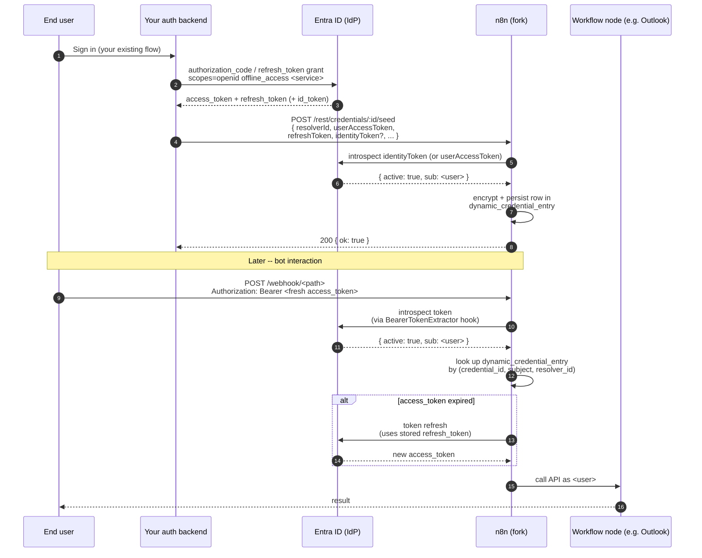

# Programmatic Credential Seeding -- Setup & Auth-Backend Integration

A fork-only extension to n8n's Dynamic Credentials feature. The vanilla
[Dynamic-Credentials-Guide.md](./Dynamic-Credentials-Guide.md) walks each end
user through an interactive OAuth consent screen. **This guide is for the
alternative path**: your own auth backend already holds the user's OAuth tokens
(e.g. from your platform's Entra/Azure AD login) and pushes them into n8n
server-to-server, with zero consent UI on the n8n side.

It pairs with the new endpoint `POST /rest/credentials/:id/seed`, documented in
`CUSTOMS.md` section 9. The runtime contract there is the source of truth; this
guide is the operator + auth-backend recipe.

---

## Table of contents

- [When to use seeding vs interactive consent](#when-to-use-seeding-vs-interactive-consent)
- [End-to-end flow](#end-to-end-flow)
- [Prerequisites](#prerequisites)
- [Part 1: One-time operator setup](#part-1-one-time-operator-setup)
  - [Step 1: Enable the feature](#step-1-enable-the-feature)
  - [Step 2: Register the OAuth2 resolver](#step-2-register-the-oauth2-resolver)
  - [Step 3: Create the dynamic credential](#step-3-create-the-dynamic-credential)
- [Part 2: Auth-backend integration (per user)](#part-2-auth-backend-integration-per-user)
  - [Sample: Node.js / TypeScript](#sample-nodejs--typescript)
  - [Sample: curl](#sample-curl)
- [Part 3: Microsoft Entra cookbook](#part-3-microsoft-entra-cookbook)
  - [Common app-registration steps](#common-app-registration-steps)
  - [Microsoft Graph services (Outlook, Teams, OneDrive)](#microsoft-graph-services-outlook-teams-onedrive)
  - [SharePoint (non-Graph audience)](#sharepoint-non-graph-audience)
  - [Azure OpenAI (non-Graph audience)](#azure-openai-non-graph-audience)
- [Part 4: Operations](#part-4-operations)
  - [When to re-seed](#when-to-re-seed)
  - [Monitoring & observability](#monitoring--observability)
  - [Rotation, revocation, off-boarding](#rotation-revocation-off-boarding)
- [Part 5: Troubleshooting](#part-5-troubleshooting)
- [API reference](#api-reference)

---

## When to use seeding vs interactive consent

| Trait                                                          | Interactive flow (Dynamic-Credentials-Guide.md) | **Seeding (this guide)**                                       |
| -------------------------------------------------------------- | ----------------------------------------------- | -------------------------------------------------------------- |
| User sees a consent screen on n8n                              | Yes                                             | No                                                             |
| Per-user enrollment trigger                                    | First call to `/authorize`                      | Auth backend pushes tokens after the user logs in elsewhere    |
| Refresh tokens come from                                       | n8n's own OAuth callback                        | Your auth backend (you supply both access + refresh tokens)    |
| Best for                                                       | Standalone n8n deployments                      | Bot platforms that already federate identity with the user IdP |
| Works with non-Graph audiences (SharePoint, Azure OpenAI, ...) | Yes, with one Entra app per audience            | Yes, with a single Entra app and `identityToken` split         |

Mix both: a tenant can use the interactive flow for a subset of users and
seeding for the rest. Same credential, same resolver, same DB rows -- the seed
endpoint and the OAuth callback both end up calling
`OauthService.saveDynamicCredential` and therefore producing
byte-identical records.

---

## End-to-end flow



Two things to internalise from the diagram:

1. **Steps 3-7 are one-time per user.** They happen out-of-band, on the auth
   backend, exactly once when the user enrolls (or when their tokens are
   force-rotated). There is no need to call `/seed` on every workflow run.
2. **Steps 8-13 are every-request.** The workflow uses the *stored* tokens. The
   `Authorization` header on the webhook only carries an identity assertion --
   it is **not** what the downstream node uses to talk to the API.

---

## Prerequisites

- A fork build that includes the seeding endpoint (section 9 of `CUSTOMS.md`).
  Verify by checking that `dist/modules/dynamic-credentials.ee/credential-seed.controller.js`
  exists in the n8n image.
- `N8N_ENV_FEAT_DYNAMIC_CREDENTIALS=true` set on every n8n process (main +
  workers).
- Enterprise license with `feat:dynamicCredentials`, or the fork's
  license-check bypass (see `Dynamic-Credentials-Guide.md` step 1).
- One Entra app registration, admin-pre-consented for every scope you intend
  to use (no consent dialog appears for end users).
- An auth backend that holds the user's refresh token (i.e. you obtained
  `offline_access` during your own user login). Without a refresh token the
  seeded credential expires after one access-token lifetime (~60 min on Entra).
- Reachability between auth backend and n8n: the backend must POST to
  `<n8n>/rest/credentials/:id/seed`. Lock that down with network policy /
  service mesh / mTLS -- the endpoint is unauthenticated at the HTTP level
  (see `CUSTOMS.md` section 9, "Auth model").

---

## Part 1: One-time operator setup

### Step 1: Enable the feature

```bash
# Required
N8N_ENV_FEAT_DYNAMIC_CREDENTIALS=true

# Strongly recommended: the static-token gate for the seed/authorize/revoke
# endpoints. Without this, anyone who can reach the n8n REST surface from
# inside your network can seed credentials.
N8N_DYNAMIC_CREDENTIALS_ENDPOINT_AUTH_TOKEN=<long random string>

# Optional CORS settings -- only relevant if a browser will call /seed
# (typically NOT the case; auth backends are server-side).
N8N_DYNAMIC_CREDENTIALS_CORS_ORIGIN=https://your-auth-backend.example.com
N8N_DYNAMIC_CREDENTIALS_CORS_ALLOW_CREDENTIALS=false
```

Restart all n8n processes. Confirm the module loaded with
`GET /rest/credential-resolvers/types` -- it returns `[]` only if the module
failed to mount.

### Step 2: Register the OAuth2 resolver

The resolver is what validates the identity tokens you pass in the seed call
and on every webhook hit. For Microsoft, point it at Entra's OIDC userinfo
endpoint or at Graph's `/me`:

```bash
curl -X POST <n8n>/rest/credential-resolvers \
  -H "Cookie: n8n-auth=<owner-session>" \
  -H "Content-Type: application/json" \
  -d '{
    "name": "Entra (Graph)",
    "type": "credential-resolver.oauth2-1.0",
    "config": {
      "metadataUri": "https://login.microsoftonline.com/<tenant-id>/v2.0/.well-known/openid-configuration",
      "clientId": "<entra-app-id>",
      "clientSecret": "<entra-app-secret>",
      "validation": "oauth2-userinfo"
    }
  }'
```

Keep the `id` returned -- that's the `resolverId` your auth backend will use.

Use **one resolver per identity-validation strategy**, not per Microsoft
service. SharePoint and Outlook can share a resolver as long as the resolver
validates Graph-audience tokens; the per-service difference is on the
`userAccessToken` you store, not on the identity proof.

### Step 3: Create the dynamic credential

Through the n8n UI: create the typed credential as you normally would
(Microsoft Outlook OAuth2 API, Microsoft Teams OAuth2 API, etc.). Then mark it
as dynamic and link it to the resolver from step 2 (the "Resolver" dropdown is
visible once Dynamic Credentials is enabled).

You don't need to fill in `Access Token` / `Refresh Token` -- the seed call
will populate them per user. The OAuth2 client ID / secret / authUrl /
accessTokenUrl fields are only used for the refresh-token grant later, so
they DO need to match the Entra app from Step 2.

Note the credential ID -- the auth backend uses it in the seed URL.

---

## Part 2: Auth-backend integration (per user)

This is the only piece your auth backend needs to add. Call it from your
post-login handler (or wherever you currently land after a user signs into
your platform).

### Sample: Node.js / TypeScript

```typescript
// Acquire a Graph-audience token + refresh token from Entra
// for the user who just signed in. Whatever flow you already use --
// MSAL OBO, refresh-token grant, etc. -- works here. Just make sure
// `offline_access` is in the scopes so you get a refresh token.

interface EntraTokens {
  access_token: string;
  refresh_token: string;
  id_token?: string;
  expires_in: number;
  scope: string;
}

async function getUserTokens(userId: string): Promise<EntraTokens> {
  // ... your existing implementation ...
}

interface SeedResult {
  ok: true;
}

async function seedN8nCredential(opts: {
  n8nBaseUrl: string;            // e.g. https://n8n.your-platform.com
  credentialId: string;          // from Step 3
  resolverId: string;            // from Step 2
  endpointAuthToken: string;     // N8N_DYNAMIC_CREDENTIALS_ENDPOINT_AUTH_TOKEN
  tokens: EntraTokens;
  // Set this when the user-facing service is NOT Microsoft Graph (e.g.
  // SharePoint, Azure OpenAI). Pass a Graph-audience access_token you
  // acquired in parallel; the resolver will use it to derive the storage
  // subject while userAccessToken is the service-audience token actually
  // stored for the workflow.
  identityToken?: string;
  metadata?: Record<string, unknown>;
}): Promise<SeedResult> {
  const url = `${opts.n8nBaseUrl}/rest/credentials/${opts.credentialId}/seed`;

  const body = {
    resolverId: opts.resolverId,
    userAccessToken: opts.tokens.access_token,
    refreshToken: opts.tokens.refresh_token,
    tokenType: 'Bearer',
    expiresIn: opts.tokens.expires_in,
    scope: opts.tokens.scope,
    identityToken: opts.identityToken,
    extraTokenFields: opts.tokens.id_token
      ? { id_token: opts.tokens.id_token }
      : undefined,
    metadata: opts.metadata,
  };

  const res = await fetch(url, {
    method: 'POST',
    headers: {
      'Content-Type': 'application/json',
      // This is the n8n network-level gate. NOT a user assertion -- it's
      // a shared secret between your auth backend and n8n.
      'X-Authorization': `Bearer ${opts.endpointAuthToken}`,
    },
    body: JSON.stringify(body),
  });

  if (!res.ok) {
    const detail = await res.text();
    throw new Error(`n8n seed failed: ${res.status} ${detail}`);
  }

  return (await res.json()) as SeedResult;
}
```

Wire it like:

```typescript
app.post('/auth/callback', async (req, res) => {
  const tokens = await exchangeCodeForTokens(req.body.code);  // your code
  const userId = await whoAmI(tokens);

  await seedN8nCredential({
    n8nBaseUrl: process.env.N8N_BASE_URL!,
    credentialId: process.env.N8N_OUTLOOK_CRED_ID!,
    resolverId: process.env.N8N_ENTRA_RESOLVER_ID!,
    endpointAuthToken: process.env.N8N_SEED_TOKEN!,
    tokens,
    metadata: { tenantId: req.body.tenantId, source: 'post-login' },
  });

  res.redirect('/');
});
```

### Sample: curl

```bash
curl -X POST "$N8N_BASE_URL/rest/credentials/$CREDENTIAL_ID/seed" \
  -H "Content-Type: application/json" \
  -H "X-Authorization: Bearer $N8N_SEED_TOKEN" \
  -d "$(cat <<JSON
  {
    "resolverId": "$RESOLVER_ID",
    "userAccessToken": "$USER_ACCESS_TOKEN",
    "refreshToken": "$USER_REFRESH_TOKEN",
    "tokenType": "Bearer",
    "expiresIn": 3599,
    "scope": "openid offline_access Mail.ReadWrite Calendars.ReadWrite",
    "metadata": { "source": "manual-test" }
  }
JSON
)"
```

Expected response on success:

```http
HTTP/1.1 200 OK
Content-Type: application/json

{ "data": { "ok": true } }
```

---

## Part 3: Microsoft Entra cookbook

### Common app-registration steps

1. **Single confidential client** in your Entra tenant (or multi-tenant if your
   platform is multi-tenant). The auth backend, not n8n, holds the client
   secret -- n8n only needs it for the refresh-token grant on stored
   credentials, but the auth backend is the one driving user consent.
2. **Redirect URI**: whatever your auth backend uses for its own login. n8n's
   redirect URI is irrelevant for this flow because n8n never sees the
   authorization-code exchange.
3. **API permissions**: add the **delegated** scopes you need (see per-service
   matrix below). Click "Grant admin consent" for the tenant. After this,
   end users never see a consent dialog -- they just sign in.
4. **`offline_access` is mandatory.** Without it, tokens you seed will not
   refresh, and the credential will expire after one access-token lifetime.

### Microsoft Graph services (Outlook, Teams, OneDrive)

All Graph services share the same token audience
(`https://graph.microsoft.com/.default`). The resolver can validate the
`userAccessToken` directly -- no `identityToken` split needed.

| Service                | Delegated scopes (examples)                            | n8n credential type             |
| ---------------------- | ------------------------------------------------------ | ------------------------------- |
| Outlook (Mail)         | `Mail.ReadWrite`, `Mail.Send`                          | `microsoftOutlookOAuth2Api`     |
| Outlook (Calendar)     | `Calendars.ReadWrite`, `Calendars.ReadWrite.Shared`    | `microsoftOutlookOAuth2Api`     |
| Teams (messaging)      | `Chat.ReadWrite`, `ChannelMessage.Send`                | `microsoftTeamsOAuth2Api`       |
| Teams (presence)       | `Presence.ReadWrite`                                   | `microsoftTeamsOAuth2Api`       |
| OneDrive               | `Files.ReadWrite.All`                                  | `microsoftOneDriveOAuth2Api`    |
| Generic Graph (HTTP)   | as needed                                              | `microsoftOAuth2Api`            |

Auth-backend acquires tokens with these scopes + `openid offline_access`, then
calls `/seed` with just `userAccessToken` and `refreshToken`.

### SharePoint (non-Graph audience)

SharePoint Online uses a tenant-scoped audience
(`https://<tenant>.sharepoint.com/.default`). A token with this audience
cannot be validated by a Graph-based resolver.

**Solution:** acquire **two** tokens in parallel during login, one for Graph
(used as `identityToken`), one for SharePoint (used as `userAccessToken`).

```typescript
const [graphTokens, sharepointTokens] = await Promise.all([
  acquireTokenForUser(userId, ['openid', 'offline_access', 'User.Read']),
  acquireTokenForUser(userId, ['openid', 'offline_access',
    'https://acme.sharepoint.com/.default']),
]);

await seedN8nCredential({
  // ... base config ...
  tokens: sharepointTokens,                       // stored on the credential
  identityToken: graphTokens.access_token,        // validated by the resolver
});
```

The refresh token stored alongside the SharePoint access token will refresh
the SharePoint audience; you do not need to re-seed when the access token
expires.

### Azure OpenAI (non-Graph audience)

Same shape as SharePoint, audience is
`https://cognitiveservices.azure.com/.default`.

```typescript
const [graphTokens, openaiTokens] = await Promise.all([
  acquireTokenForUser(userId, ['openid', 'offline_access', 'User.Read']),
  acquireTokenForUser(userId, ['openid', 'offline_access',
    'https://cognitiveservices.azure.com/.default']),
]);
```

n8n credential type: `azureEntraCognitiveServicesOAuth2Api` (see CUSTOMS.md
section 4 for the fork's APIM-aware variant).

---

## Part 4: Operations

### When to re-seed

Re-seed when **any** of the following happens:

- The user signs into your platform on a fresh tenant (subject changes).
- Entra invalidates the refresh token (admin action, conditional-access
  policy, password change, MFA reset).
- You add new scopes to the Entra app and the user has not yet been issued a
  token with those scopes -- they need a fresh login and a re-seed.

Re-seeding is idempotent: the storage layer upserts on
`(credential_id, subject_id, resolver_id)`. Same subject overwrites the
existing blob; different subject creates a second row, which is harmless but
will not be reached because the resolver always picks the row matching the
introspected subject.

**You do not re-seed on every webhook call.** The OAuth2 refresh loop inside
n8n handles access-token expiry automatically using the stored refresh token.

### Monitoring & observability

The endpoint logs:

- Successful seeds at `debug` level
  (`"Dynamic credential seeded" { credentialId, resolverId, split }`).
- `CredentialStorageError` translated to 400 -- e.g. resolver introspection
  failed because the identity token was for the wrong tenant.
- Unexpected errors at `error` level with the credential ID and resolver ID,
  message scrubbed from the HTTP response to avoid leaking internal state.

Production deployments should:

- Alert on 4xx rate from `/rest/credentials/:id/seed` -- typically a config
  mismatch (wrong tenant, wrong audience, expired client secret).
- Track the `dynamic_credential_entry` row count per credential to detect
  unbounded growth (one row per unique subject; if subjects are not stable
  the table will balloon).
- Pair with the fork's Prometheus metrics (`CUSTOMS.md` section 5) -- the
  `project_id` and `execution_mode` labels make it easy to filter for
  workflows that should have been hitting seeded credentials.

### Rotation, revocation, off-boarding

| Trigger                                       | Auth backend action                                                                          | n8n action                                                                |
| --------------------------------------------- | -------------------------------------------------------------------------------------------- | ------------------------------------------------------------------------- |
| Refresh-token rotation by Entra               | Persist new refresh token in your store, optionally re-seed                                  | None -- next workflow run refreshes naturally                             |
| Entra app secret rotation                     | Update the secret on the resolver config + credential                                        | Restart n8n so resolvers reload their config cache                        |
| User scope expansion (new permission granted) | Drive user through fresh login, re-seed                                                      | None                                                                     |
| User off-boarding                             | Call `DELETE /rest/credentials/:id/revoke?resolverId=<id>` with the user's bearer token *or* | Removes the user's row from `dynamic_credential_entry`                    |
| Tenant-wide off-boarding                      | Delete the resolver (`DELETE /rest/credential-resolvers/:id`)                                | Cascades to all entries (FK `onDelete: CASCADE` on `dynamic_credential_*`) |

---

## Part 5: Troubleshooting

| Symptom                                                                                  | Likely cause                                                                                                         | Fix                                                                                                                                |
| ---------------------------------------------------------------------------------------- | -------------------------------------------------------------------------------------------------------------------- | ---------------------------------------------------------------------------------------------------------------------------------- |
| `400 Bad Request` with `Invalid request body: ...` on `/seed`                            | JSON shape doesn't match the schema (typo, missing required field)                                                   | The message names the failing path -- fix the field and retry                                                                      |
| `400 Bad Request` with `Failed to store dynamic credentials data for "..."`              | Resolver couldn't validate the identity token (wrong tenant, wrong audience, expired token) **or** cipher misconfig | Server logs hold the cause. Most common: forgot to pass `identityToken` for a non-Graph `userAccessToken`                          |
| `400 Bad Request` with `Failed to seed credential`                                       | Unexpected internal error (DB outage, OOM, missing nodes-base credential type on a stripped image)                  | Server logs hold the cause                                                                                                         |
| `400 Bad Request` with `Credential is not marked as dynamic`                             | You created the credential but didn't tick "Use Dynamic Credential" (or didn't link a resolver)                      | Open the credential in n8n UI, enable dynamic + select resolver, save                                                              |
| `400 Bad Request` with `Only OAuth2 credentials can be seeded`                            | Tried to seed an `httpBasicAuth` / `apiKey` / non-OAuth2 credential                                                  | Seeding only makes sense for OAuth2 -- other types don't have a refresh path                                                       |
| `404 Not Found` `Credential not found`                                                   | Credential ID typo, or credential was deleted                                                                        | Re-fetch the ID from the UI                                                                                                        |
| `404 Not Found` `Resolver not found`                                                     | Resolver ID typo, or resolver was deleted                                                                            | Re-fetch the ID via `GET /rest/credential-resolvers`                                                                               |
| `401 Unauthorized`                                                                       | Missing or wrong `X-Authorization`                                                                                   | Confirm `N8N_DYNAMIC_CREDENTIALS_ENDPOINT_AUTH_TOKEN` is set on n8n AND your auth backend sends `X-Authorization: Bearer <same>` |
| Workflow runs as wrong user / "Credentials not found" at execution time                  | Resolver subject doesn't match the bearer token used on the webhook                                                  | Confirm the resolver's `subjectClaim` is consistent between seed and webhook paths (default: `sub`)                                |
| Stored credential works once then dies after ~60 minutes                                  | No refresh token, or refresh token grant is rejected                                                                | Verify `offline_access` scope. Verify the Entra app's refresh-token settings (single-tenant vs multi-tenant)                       |
| Two `dynamic_credential_entry` rows for the same user                                    | Two distinct subjects from two introspections (e.g. resolver changed from `sub` to `oid`)                            | Pick one claim, update the resolver config, delete stale rows                                                                      |

---

## API reference

### `POST /rest/credentials/:id/seed`

Push a user's OAuth tokens into the dynamic-credential store.

**Headers**

| Name              | Required | Notes                                                       |
| ----------------- | -------- | ----------------------------------------------------------- |
| `Content-Type`    | yes      | `application/json`                                          |
| `X-Authorization` | yes\*    | `Bearer <N8N_DYNAMIC_CREDENTIALS_ENDPOINT_AUTH_TOKEN>` -- required unless the call is from an authenticated n8n cookie session |

**Body**

| Field              | Type                    | Required | Default  | Notes                                                                                          |
| ------------------ | ----------------------- | -------- | -------- | ---------------------------------------------------------------------------------------------- |
| `resolverId`       | string                  | yes      | -        | From Step 2                                                                                    |
| `userAccessToken`  | string                  | yes      | -        | Stored as `oauthTokenData.access_token`. Used by the workflow node                             |
| `refreshToken`     | string                  | yes      | -        | Stored as `oauthTokenData.refresh_token`. Used by n8n to refresh `userAccessToken` on expiry  |
| `identityToken`    | string                  | no       | -        | If set, used as the resolver identity (Graph-aud). Pass when `userAccessToken` is not Graph    |
| `tokenType`        | string                  | no       | `Bearer` | Stored as `oauthTokenData.token_type`                                                          |
| `expiresIn`        | number (int, positive)  | no       | `3599`   | Stored as `oauthTokenData.expires_in`                                                          |
| `scope`            | string                  | no       | -        | Stored as `oauthTokenData.scope`                                                               |
| `extraTokenFields` | object                  | no       | -        | Merged into `oauthTokenData` -- use for `id_token`, `ext_expires_in`, vendor claims            |
| `metadata`         | object                  | no       | -        | Merged into the audit metadata. The endpoint always prepends `{ source: 'seed', enrolledAt }` |

Unknown fields are forwarded into `oauthTokenData` (schema uses `.passthrough()`).

**Responses**

| Status | Body                                  | When                                                                              |
| ------ | ------------------------------------- | --------------------------------------------------------------------------------- |
| 200    | `{ "data": { "ok": true } }`           | Success                                                                           |
| 400    | `{ "code": 400, "message": "..." }`    | Bad body, non-OAuth2 credential, non-resolvable credential, resolver errors       |
| 401    | n8n auth envelope                     | Missing / invalid `X-Authorization` (and no n8n session cookie)                   |
| 404    | `{ "code": 404, "message": "..." }`    | Credential or resolver doesn't exist                                              |
