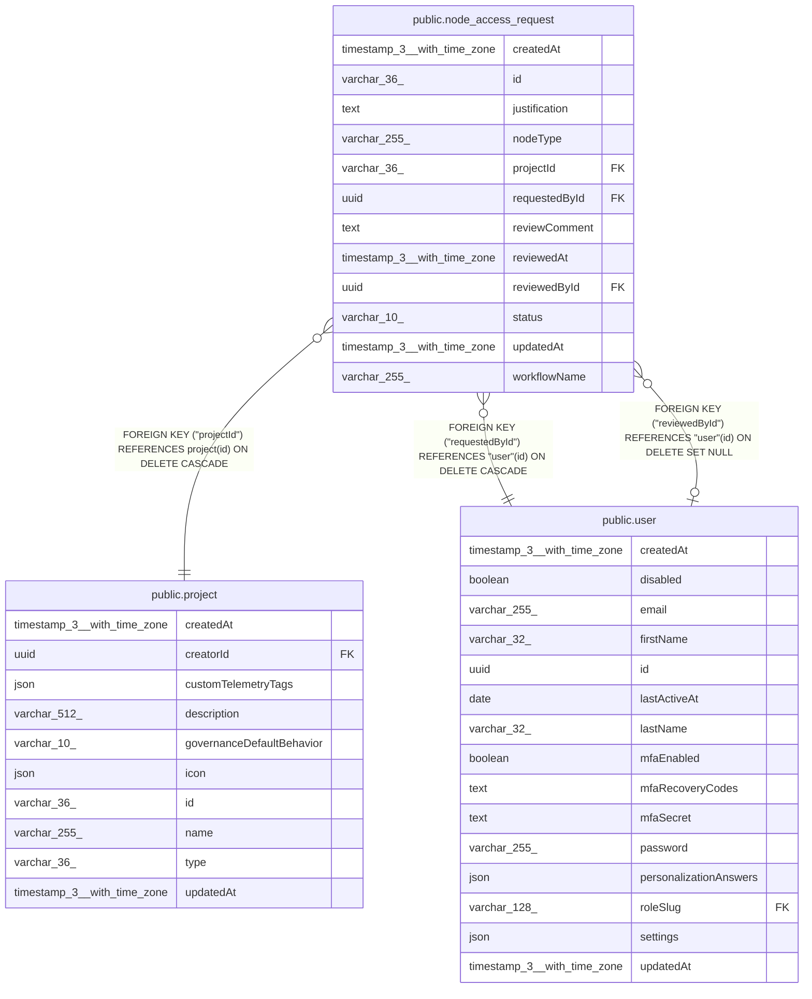

# public.node_access_request

## Columns

| Name | Type | Default | Nullable | Children | Parents | Comment |
| ---- | ---- | ------- | -------- | -------- | ------- | ------- |
| createdAt | timestamp(3) with time zone | CURRENT_TIMESTAMP(3) | false |  |  |  |
| id | varchar(36) |  | false |  |  |  |
| justification | text |  | false |  |  |  |
| nodeType | varchar(255) |  | false |  |  |  |
| projectId | varchar(36) |  | false |  | [public.project](public.project.md) |  |
| requestedById | uuid |  | false |  | [public.user](public.user.md) |  |
| reviewComment | text |  | true |  |  |  |
| reviewedAt | timestamp(3) with time zone |  | true |  |  |  |
| reviewedById | uuid |  | true |  | [public.user](public.user.md) |  |
| status | varchar(10) | 'pending'::character varying | false |  |  |  |
| updatedAt | timestamp(3) with time zone | CURRENT_TIMESTAMP(3) | false |  |  |  |
| workflowName | varchar(255) |  | true |  |  |  |

## Constraints

| Name | Type | Definition |
| ---- | ---- | ---------- |
| CHK_node_access_request_status | CHECK | CHECK (((status)::text = ANY ((ARRAY['pending'::character varying, 'approved'::character varying, 'rejected'::character varying])::text[]))) |
| FK_3675bf925030285f824d4d803dc | FOREIGN KEY | FOREIGN KEY ("projectId") REFERENCES project(id) ON DELETE CASCADE |
| FK_bf1549a050b0102311859cc705f | FOREIGN KEY | FOREIGN KEY ("requestedById") REFERENCES "user"(id) ON DELETE CASCADE |
| FK_f624bcbd08c0f89b88b30ab63c2 | FOREIGN KEY | FOREIGN KEY ("reviewedById") REFERENCES "user"(id) ON DELETE SET NULL |
| PK_58af6eb5a63fc4ddcc35935aff2 | PRIMARY KEY | PRIMARY KEY (id) |
| node_access_request_createdAt_not_null | n | NOT NULL "createdAt" |
| node_access_request_id_not_null | n | NOT NULL id |
| node_access_request_justification_not_null | n | NOT NULL justification |
| node_access_request_nodeType_not_null | n | NOT NULL "nodeType" |
| node_access_request_projectId_not_null | n | NOT NULL "projectId" |
| node_access_request_requestedById_not_null | n | NOT NULL "requestedById" |
| node_access_request_status_not_null | n | NOT NULL status |
| node_access_request_updatedAt_not_null | n | NOT NULL "updatedAt" |

## Indexes

| Name | Definition |
| ---- | ---------- |
| IDX_8db98daee02caa6f3354777f27 | CREATE INDEX "IDX_8db98daee02caa6f3354777f27" ON public.node_access_request USING btree ("projectId", status) |
| IDX_fa55b50ed0439b86cd48626e87 | CREATE INDEX "IDX_fa55b50ed0439b86cd48626e87" ON public.node_access_request USING btree ("requestedById", status) |
| IDX_node_access_request_pending_unique | CREATE UNIQUE INDEX "IDX_node_access_request_pending_unique" ON public.node_access_request USING btree ("requestedById", "nodeType", "projectId") WHERE ((status)::text = 'pending'::text) |
| PK_58af6eb5a63fc4ddcc35935aff2 | CREATE UNIQUE INDEX "PK_58af6eb5a63fc4ddcc35935aff2" ON public.node_access_request USING btree (id) |

## Relations

---

> Generated by [tbls](https://github.com/k1LoW/tbls)
