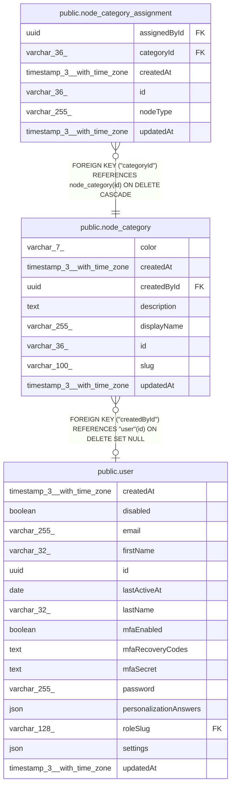

# public.node_category

## Columns

| Name | Type | Default | Nullable | Children | Parents | Comment |
| ---- | ---- | ------- | -------- | -------- | ------- | ------- |
| color | varchar(7) |  | true |  |  |  |
| createdAt | timestamp(3) with time zone | CURRENT_TIMESTAMP(3) | false |  |  |  |
| createdById | uuid |  | true |  | [public.user](public.user.md) |  |
| description | text |  | true |  |  |  |
| displayName | varchar(255) |  | false |  |  |  |
| id | varchar(36) |  | false | [public.node_category_assignment](public.node_category_assignment.md) |  |  |
| slug | varchar(100) |  | false |  |  |  |
| updatedAt | timestamp(3) with time zone | CURRENT_TIMESTAMP(3) | false |  |  |  |

## Constraints

| Name | Type | Definition |
| ---- | ---- | ---------- |
| FK_ca74f9f8f3ab9a2bf32c2efc504 | FOREIGN KEY | FOREIGN KEY ("createdById") REFERENCES "user"(id) ON DELETE SET NULL |
| PK_5c11251a40520d1481a3d41dbbf | PRIMARY KEY | PRIMARY KEY (id) |
| UQ_79bf752be3fd0aebdb65828b612 | UNIQUE | UNIQUE (slug) |
| node_category_createdAt_not_null | n | NOT NULL "createdAt" |
| node_category_displayName_not_null | n | NOT NULL "displayName" |
| node_category_id_not_null | n | NOT NULL id |
| node_category_slug_not_null | n | NOT NULL slug |
| node_category_updatedAt_not_null | n | NOT NULL "updatedAt" |

## Indexes

| Name | Definition |
| ---- | ---------- |
| PK_5c11251a40520d1481a3d41dbbf | CREATE UNIQUE INDEX "PK_5c11251a40520d1481a3d41dbbf" ON public.node_category USING btree (id) |
| UQ_79bf752be3fd0aebdb65828b612 | CREATE UNIQUE INDEX "UQ_79bf752be3fd0aebdb65828b612" ON public.node_category USING btree (slug) |

## Relations

---

> Generated by [tbls](https://github.com/k1LoW/tbls)
