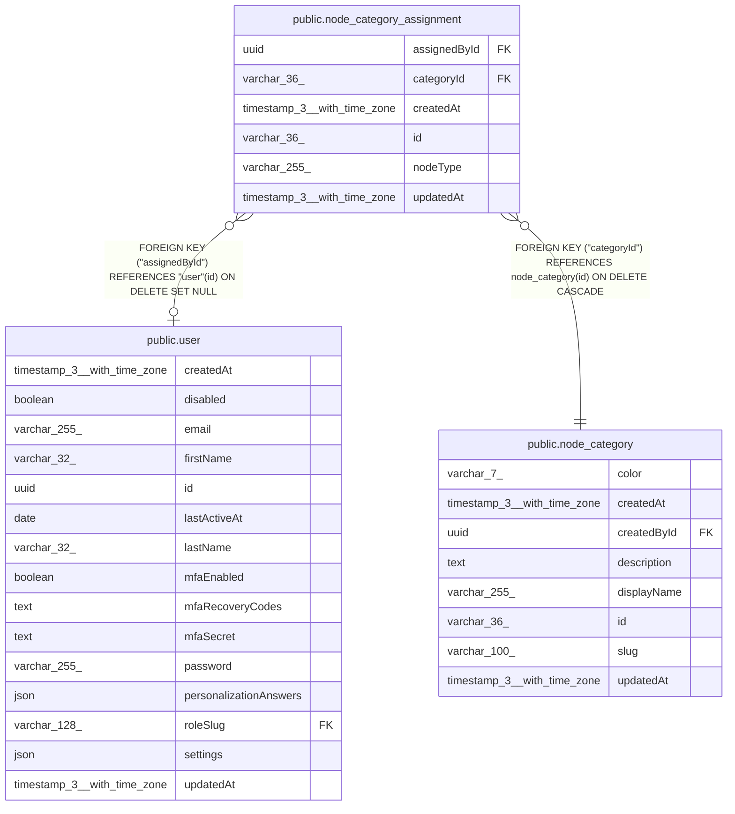

# public.node_category_assignment

## Columns

| Name | Type | Default | Nullable | Children | Parents | Comment |
| ---- | ---- | ------- | -------- | -------- | ------- | ------- |
| assignedById | uuid |  | true |  | [public.user](public.user.md) |  |
| categoryId | varchar(36) |  | false |  | [public.node_category](public.node_category.md) |  |
| createdAt | timestamp(3) with time zone | CURRENT_TIMESTAMP(3) | false |  |  |  |
| id | varchar(36) |  | false |  |  |  |
| nodeType | varchar(255) |  | false |  |  |  |
| updatedAt | timestamp(3) with time zone | CURRENT_TIMESTAMP(3) | false |  |  |  |

## Constraints

| Name | Type | Definition |
| ---- | ---- | ---------- |
| FK_6bf8bc8924770d30039d479c8d4 | FOREIGN KEY | FOREIGN KEY ("assignedById") REFERENCES "user"(id) ON DELETE SET NULL |
| FK_c3b2f6574ff3736c573f76753ea | FOREIGN KEY | FOREIGN KEY ("categoryId") REFERENCES node_category(id) ON DELETE CASCADE |
| PK_9683b4b9cdb665e29d29607763c | PRIMARY KEY | PRIMARY KEY (id) |
| UQ_6be2e465fdfac9b2ee779e231b4 | UNIQUE | UNIQUE ("categoryId", "nodeType") |
| node_category_assignment_categoryId_not_null | n | NOT NULL "categoryId" |
| node_category_assignment_createdAt_not_null | n | NOT NULL "createdAt" |
| node_category_assignment_id_not_null | n | NOT NULL id |
| node_category_assignment_nodeType_not_null | n | NOT NULL "nodeType" |
| node_category_assignment_updatedAt_not_null | n | NOT NULL "updatedAt" |

## Indexes

| Name | Definition |
| ---- | ---------- |
| IDX_b0e2dc17ba64c3a2ffce5e2489 | CREATE INDEX "IDX_b0e2dc17ba64c3a2ffce5e2489" ON public.node_category_assignment USING btree ("nodeType") |
| PK_9683b4b9cdb665e29d29607763c | CREATE UNIQUE INDEX "PK_9683b4b9cdb665e29d29607763c" ON public.node_category_assignment USING btree (id) |
| UQ_6be2e465fdfac9b2ee779e231b4 | CREATE UNIQUE INDEX "UQ_6be2e465fdfac9b2ee779e231b4" ON public.node_category_assignment USING btree ("categoryId", "nodeType") |

## Relations

---

> Generated by [tbls](https://github.com/k1LoW/tbls)
