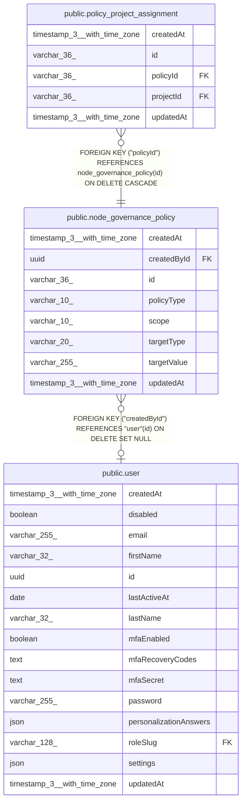

# public.node_governance_policy

## Columns

| Name | Type | Default | Nullable | Children | Parents | Comment |
| ---- | ---- | ------- | -------- | -------- | ------- | ------- |
| createdAt | timestamp(3) with time zone | CURRENT_TIMESTAMP(3) | false |  |  |  |
| createdById | uuid |  | true |  | [public.user](public.user.md) |  |
| id | varchar(36) |  | false | [public.policy_project_assignment](public.policy_project_assignment.md) |  |  |
| policyType | varchar(10) |  | false |  |  |  |
| scope | varchar(10) | 'global'::character varying | false |  |  |  |
| targetType | varchar(20) |  | false |  |  |  |
| targetValue | varchar(255) |  | false |  |  |  |
| updatedAt | timestamp(3) with time zone | CURRENT_TIMESTAMP(3) | false |  |  |  |

## Constraints

| Name | Type | Definition |
| ---- | ---- | ---------- |
| CHK_node_governance_policy_policyType | CHECK | CHECK ((("policyType")::text = ANY ((ARRAY['allow'::character varying, 'block'::character varying])::text[]))) |
| CHK_node_governance_policy_scope | CHECK | CHECK (((scope)::text = ANY ((ARRAY['global'::character varying, 'projects'::character varying])::text[]))) |
| CHK_node_governance_policy_targetType | CHECK | CHECK ((("targetType")::text = ANY ((ARRAY['node'::character varying, 'category'::character varying])::text[]))) |
| FK_f91f3f54f46a303750f396aea3f | FOREIGN KEY | FOREIGN KEY ("createdById") REFERENCES "user"(id) ON DELETE SET NULL |
| PK_21a5cbe21c3cad64e81785240b5 | PRIMARY KEY | PRIMARY KEY (id) |
| node_governance_policy_createdAt_not_null | n | NOT NULL "createdAt" |
| node_governance_policy_id_not_null | n | NOT NULL id |
| node_governance_policy_policyType_not_null | n | NOT NULL "policyType" |
| node_governance_policy_scope_not_null | n | NOT NULL scope |
| node_governance_policy_targetType_not_null | n | NOT NULL "targetType" |
| node_governance_policy_targetValue_not_null | n | NOT NULL "targetValue" |
| node_governance_policy_updatedAt_not_null | n | NOT NULL "updatedAt" |

## Indexes

| Name | Definition |
| ---- | ---------- |
| IDX_d0baae510dded84885b83fac52 | CREATE INDEX "IDX_d0baae510dded84885b83fac52" ON public.node_governance_policy USING btree (scope, "targetType", "targetValue") |
| PK_21a5cbe21c3cad64e81785240b5 | CREATE UNIQUE INDEX "PK_21a5cbe21c3cad64e81785240b5" ON public.node_governance_policy USING btree (id) |

## Relations

---

> Generated by [tbls](https://github.com/k1LoW/tbls)
