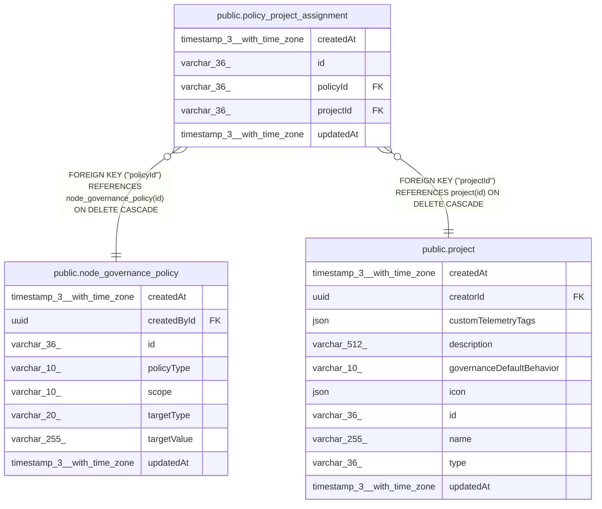

# public.policy_project_assignment

## Columns

| Name | Type | Default | Nullable | Children | Parents | Comment |
| ---- | ---- | ------- | -------- | -------- | ------- | ------- |
| createdAt | timestamp(3) with time zone | CURRENT_TIMESTAMP(3) | false |  |  |  |
| id | varchar(36) |  | false |  |  |  |
| policyId | varchar(36) |  | false |  | [public.node_governance_policy](public.node_governance_policy.md) |  |
| projectId | varchar(36) |  | false |  | [public.project](public.project.md) |  |
| updatedAt | timestamp(3) with time zone | CURRENT_TIMESTAMP(3) | false |  |  |  |

## Constraints

| Name | Type | Definition |
| ---- | ---- | ---------- |
| FK_5d947e0c262caa4d97314eaf54b | FOREIGN KEY | FOREIGN KEY ("policyId") REFERENCES node_governance_policy(id) ON DELETE CASCADE |
| FK_d11e9d4d2e9b75f6ab4a730d23a | FOREIGN KEY | FOREIGN KEY ("projectId") REFERENCES project(id) ON DELETE CASCADE |
| PK_eee50c54760731eb608bda54928 | PRIMARY KEY | PRIMARY KEY (id) |
| UQ_d796bcabdfd68e47a6e43b56b5f | UNIQUE | UNIQUE ("policyId", "projectId") |
| policy_project_assignment_createdAt_not_null | n | NOT NULL "createdAt" |
| policy_project_assignment_id_not_null | n | NOT NULL id |
| policy_project_assignment_policyId_not_null | n | NOT NULL "policyId" |
| policy_project_assignment_projectId_not_null | n | NOT NULL "projectId" |
| policy_project_assignment_updatedAt_not_null | n | NOT NULL "updatedAt" |

## Indexes

| Name | Definition |
| ---- | ---------- |
| IDX_d11e9d4d2e9b75f6ab4a730d23 | CREATE INDEX "IDX_d11e9d4d2e9b75f6ab4a730d23" ON public.policy_project_assignment USING btree ("projectId") |
| PK_eee50c54760731eb608bda54928 | CREATE UNIQUE INDEX "PK_eee50c54760731eb608bda54928" ON public.policy_project_assignment USING btree (id) |
| UQ_d796bcabdfd68e47a6e43b56b5f | CREATE UNIQUE INDEX "UQ_d796bcabdfd68e47a6e43b56b5f" ON public.policy_project_assignment USING btree ("policyId", "projectId") |

## Relations

---

> Generated by [tbls](https://github.com/k1LoW/tbls)
