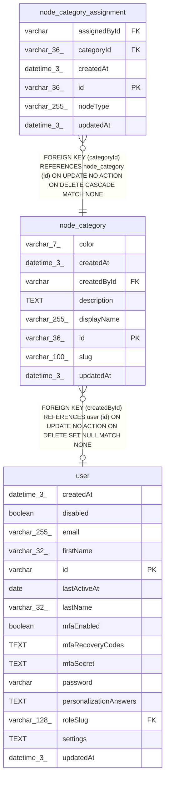

# node_category

## Description

<details>
<summary><strong>Table Definition</strong></summary>

```sql
CREATE TABLE "node_category" ("id" varchar(36) PRIMARY KEY NOT NULL, "slug" varchar(100) NOT NULL, "displayName" varchar(255) NOT NULL, "description" text, "color" varchar(7), "createdById" varchar, "createdAt" datetime(3) NOT NULL DEFAULT (STRFTIME('%Y-%m-%d %H:%M:%f', 'NOW')), "updatedAt" datetime(3) NOT NULL DEFAULT (STRFTIME('%Y-%m-%d %H:%M:%f', 'NOW')), CONSTRAINT "UQ_79bf752be3fd0aebdb65828b612" UNIQUE ("slug"), CONSTRAINT "FK_ca74f9f8f3ab9a2bf32c2efc504" FOREIGN KEY ("createdById") REFERENCES "user" ("id") ON DELETE SET NULL)
```

</details>

## Columns

| Name | Type | Default | Nullable | Children | Parents | Comment |
| ---- | ---- | ------- | -------- | -------- | ------- | ------- |
| color | varchar(7) |  | true |  |  |  |
| createdAt | datetime(3) | STRFTIME('%Y-%m-%d %H:%M:%f', 'NOW') | false |  |  |  |
| createdById | varchar |  | true |  | [user](user.md) |  |
| description | TEXT |  | true |  |  |  |
| displayName | varchar(255) |  | false |  |  |  |
| id | varchar(36) |  | false | [node_category_assignment](node_category_assignment.md) |  |  |
| slug | varchar(100) |  | false |  |  |  |
| updatedAt | datetime(3) | STRFTIME('%Y-%m-%d %H:%M:%f', 'NOW') | false |  |  |  |

## Constraints

| Name | Type | Definition |
| ---- | ---- | ---------- |
| - (Foreign key ID: 0) | FOREIGN KEY | FOREIGN KEY (createdById) REFERENCES user (id) ON UPDATE NO ACTION ON DELETE SET NULL MATCH NONE |
| id | PRIMARY KEY | PRIMARY KEY (id) |
| sqlite_autoindex_node_category_1 | PRIMARY KEY | PRIMARY KEY (id) |
| sqlite_autoindex_node_category_2 | UNIQUE | UNIQUE (slug) |

## Indexes

| Name | Definition |
| ---- | ---------- |
| sqlite_autoindex_node_category_1 | PRIMARY KEY (id) |
| sqlite_autoindex_node_category_2 | UNIQUE (slug) |

## Relations



---

> Generated by [tbls](https://github.com/k1LoW/tbls)
