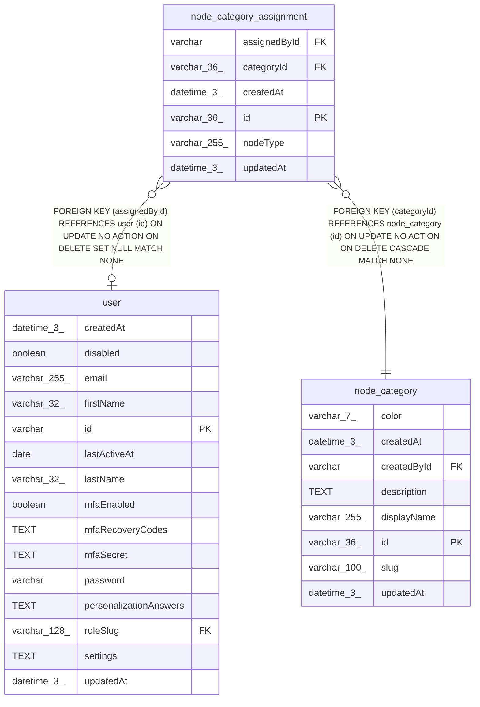

# node_category_assignment

## Description

<details>
<summary><strong>Table Definition</strong></summary>

```sql
CREATE TABLE "node_category_assignment" ("id" varchar(36) PRIMARY KEY NOT NULL, "categoryId" varchar(36) NOT NULL, "nodeType" varchar(255) NOT NULL, "assignedById" varchar, "createdAt" datetime(3) NOT NULL DEFAULT (STRFTIME('%Y-%m-%d %H:%M:%f', 'NOW')), "updatedAt" datetime(3) NOT NULL DEFAULT (STRFTIME('%Y-%m-%d %H:%M:%f', 'NOW')), CONSTRAINT "UQ_6be2e465fdfac9b2ee779e231b4" UNIQUE ("categoryId", "nodeType"), CONSTRAINT "FK_c3b2f6574ff3736c573f76753ea" FOREIGN KEY ("categoryId") REFERENCES "node_category" ("id") ON DELETE CASCADE, CONSTRAINT "FK_6bf8bc8924770d30039d479c8d4" FOREIGN KEY ("assignedById") REFERENCES "user" ("id") ON DELETE SET NULL)
```

</details>

## Columns

| Name | Type | Default | Nullable | Children | Parents | Comment |
| ---- | ---- | ------- | -------- | -------- | ------- | ------- |
| assignedById | varchar |  | true |  | [user](user.md) |  |
| categoryId | varchar(36) |  | false |  | [node_category](node_category.md) |  |
| createdAt | datetime(3) | STRFTIME('%Y-%m-%d %H:%M:%f', 'NOW') | false |  |  |  |
| id | varchar(36) |  | false |  |  |  |
| nodeType | varchar(255) |  | false |  |  |  |
| updatedAt | datetime(3) | STRFTIME('%Y-%m-%d %H:%M:%f', 'NOW') | false |  |  |  |

## Constraints

| Name | Type | Definition |
| ---- | ---- | ---------- |
| - (Foreign key ID: 0) | FOREIGN KEY | FOREIGN KEY (assignedById) REFERENCES user (id) ON UPDATE NO ACTION ON DELETE SET NULL MATCH NONE |
| - (Foreign key ID: 1) | FOREIGN KEY | FOREIGN KEY (categoryId) REFERENCES node_category (id) ON UPDATE NO ACTION ON DELETE CASCADE MATCH NONE |
| id | PRIMARY KEY | PRIMARY KEY (id) |
| sqlite_autoindex_node_category_assignment_1 | PRIMARY KEY | PRIMARY KEY (id) |
| sqlite_autoindex_node_category_assignment_2 | UNIQUE | UNIQUE (categoryId, nodeType) |

## Indexes

| Name | Definition |
| ---- | ---------- |
| IDX_b0e2dc17ba64c3a2ffce5e2489 | CREATE INDEX "IDX_b0e2dc17ba64c3a2ffce5e2489" ON "node_category_assignment" ("nodeType")  |
| sqlite_autoindex_node_category_assignment_1 | PRIMARY KEY (id) |
| sqlite_autoindex_node_category_assignment_2 | UNIQUE (categoryId, nodeType) |

## Relations



---

> Generated by [tbls](https://github.com/k1LoW/tbls)
