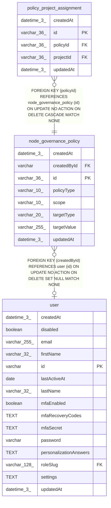

# node_governance_policy

## Description

<details>
<summary><strong>Table Definition</strong></summary>

```sql
CREATE TABLE "node_governance_policy" ("id" varchar(36) PRIMARY KEY NOT NULL, "policyType" varchar(10) NOT NULL, "scope" varchar(10) NOT NULL DEFAULT ('global'), "targetType" varchar(20) NOT NULL, "targetValue" varchar(255) NOT NULL, "createdById" varchar, "createdAt" datetime(3) NOT NULL DEFAULT (STRFTIME('%Y-%m-%d %H:%M:%f', 'NOW')), "updatedAt" datetime(3) NOT NULL DEFAULT (STRFTIME('%Y-%m-%d %H:%M:%f', 'NOW')), CONSTRAINT "CHK_node_governance_policy_policyType" CHECK ("policyType" IN ('allow', 'block')), CONSTRAINT "CHK_node_governance_policy_scope" CHECK ("scope" IN ('global', 'projects')), CONSTRAINT "CHK_node_governance_policy_targetType" CHECK ("targetType" IN ('node', 'category')), CONSTRAINT "FK_f91f3f54f46a303750f396aea3f" FOREIGN KEY ("createdById") REFERENCES "user" ("id") ON DELETE SET NULL)
```

</details>

## Columns

| Name | Type | Default | Nullable | Children | Parents | Comment |
| ---- | ---- | ------- | -------- | -------- | ------- | ------- |
| createdAt | datetime(3) | STRFTIME('%Y-%m-%d %H:%M:%f', 'NOW') | false |  |  |  |
| createdById | varchar |  | true |  | [user](user.md) |  |
| id | varchar(36) |  | false | [policy_project_assignment](policy_project_assignment.md) |  |  |
| policyType | varchar(10) |  | false |  |  |  |
| scope | varchar(10) | 'global' | false |  |  |  |
| targetType | varchar(20) |  | false |  |  |  |
| targetValue | varchar(255) |  | false |  |  |  |
| updatedAt | datetime(3) | STRFTIME('%Y-%m-%d %H:%M:%f', 'NOW') | false |  |  |  |

## Constraints

| Name | Type | Definition |
| ---- | ---- | ---------- |
| - | CHECK | CHECK ("policyType" IN ('allow', 'block')) |
| - | CHECK | CHECK ("scope" IN ('global', 'projects')) |
| - | CHECK | CHECK ("targetType" IN ('node', 'category')) |
| - (Foreign key ID: 0) | FOREIGN KEY | FOREIGN KEY (createdById) REFERENCES user (id) ON UPDATE NO ACTION ON DELETE SET NULL MATCH NONE |
| id | PRIMARY KEY | PRIMARY KEY (id) |
| sqlite_autoindex_node_governance_policy_1 | PRIMARY KEY | PRIMARY KEY (id) |

## Indexes

| Name | Definition |
| ---- | ---------- |
| IDX_d0baae510dded84885b83fac52 | CREATE INDEX "IDX_d0baae510dded84885b83fac52" ON "node_governance_policy" ("scope", "targetType", "targetValue")  |
| sqlite_autoindex_node_governance_policy_1 | PRIMARY KEY (id) |

## Relations



---

> Generated by [tbls](https://github.com/k1LoW/tbls)
