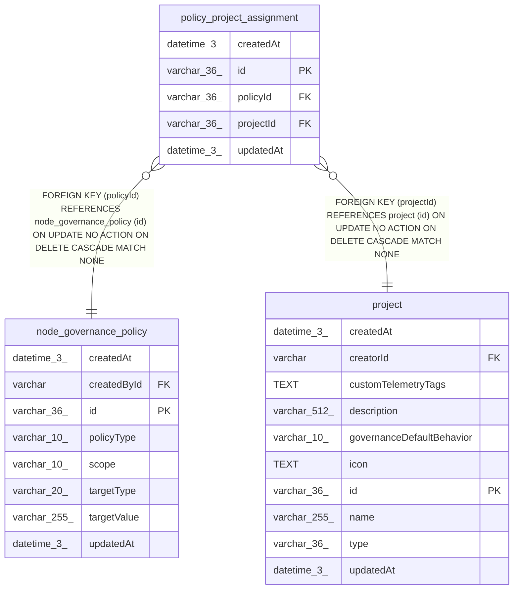

# policy_project_assignment

## Description

<details>
<summary><strong>Table Definition</strong></summary>

```sql
CREATE TABLE "policy_project_assignment" ("id" varchar(36) PRIMARY KEY NOT NULL, "policyId" varchar(36) NOT NULL, "projectId" varchar(36) NOT NULL, "createdAt" datetime(3) NOT NULL DEFAULT (STRFTIME('%Y-%m-%d %H:%M:%f', 'NOW')), "updatedAt" datetime(3) NOT NULL DEFAULT (STRFTIME('%Y-%m-%d %H:%M:%f', 'NOW')), CONSTRAINT "UQ_d796bcabdfd68e47a6e43b56b5f" UNIQUE ("policyId", "projectId"), CONSTRAINT "FK_5d947e0c262caa4d97314eaf54b" FOREIGN KEY ("policyId") REFERENCES "node_governance_policy" ("id") ON DELETE CASCADE, CONSTRAINT "FK_d11e9d4d2e9b75f6ab4a730d23a" FOREIGN KEY ("projectId") REFERENCES "project" ("id") ON DELETE CASCADE)
```

</details>

## Columns

| Name | Type | Default | Nullable | Children | Parents | Comment |
| ---- | ---- | ------- | -------- | -------- | ------- | ------- |
| createdAt | datetime(3) | STRFTIME('%Y-%m-%d %H:%M:%f', 'NOW') | false |  |  |  |
| id | varchar(36) |  | false |  |  |  |
| policyId | varchar(36) |  | false |  | [node_governance_policy](node_governance_policy.md) |  |
| projectId | varchar(36) |  | false |  | [project](project.md) |  |
| updatedAt | datetime(3) | STRFTIME('%Y-%m-%d %H:%M:%f', 'NOW') | false |  |  |  |

## Constraints

| Name | Type | Definition |
| ---- | ---- | ---------- |
| - (Foreign key ID: 0) | FOREIGN KEY | FOREIGN KEY (projectId) REFERENCES project (id) ON UPDATE NO ACTION ON DELETE CASCADE MATCH NONE |
| - (Foreign key ID: 1) | FOREIGN KEY | FOREIGN KEY (policyId) REFERENCES node_governance_policy (id) ON UPDATE NO ACTION ON DELETE CASCADE MATCH NONE |
| id | PRIMARY KEY | PRIMARY KEY (id) |
| sqlite_autoindex_policy_project_assignment_1 | PRIMARY KEY | PRIMARY KEY (id) |
| sqlite_autoindex_policy_project_assignment_2 | UNIQUE | UNIQUE (policyId, projectId) |

## Indexes

| Name | Definition |
| ---- | ---------- |
| IDX_d11e9d4d2e9b75f6ab4a730d23 | CREATE INDEX "IDX_d11e9d4d2e9b75f6ab4a730d23" ON "policy_project_assignment" ("projectId")  |
| sqlite_autoindex_policy_project_assignment_1 | PRIMARY KEY (id) |
| sqlite_autoindex_policy_project_assignment_2 | UNIQUE (policyId, projectId) |

## Relations



---

> Generated by [tbls](https://github.com/k1LoW/tbls)
